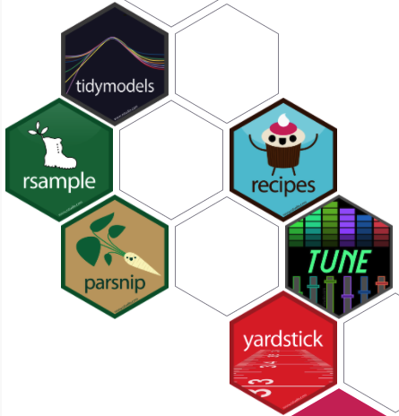
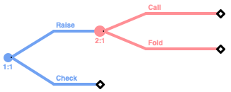
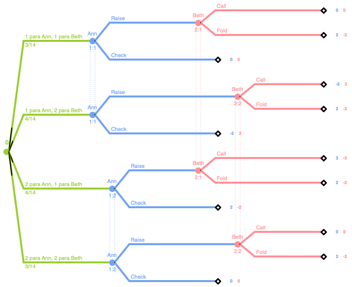
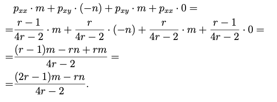
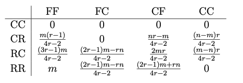
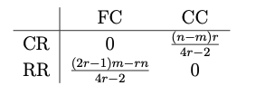
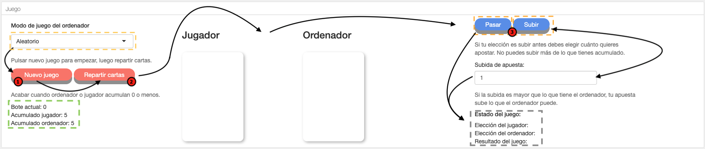
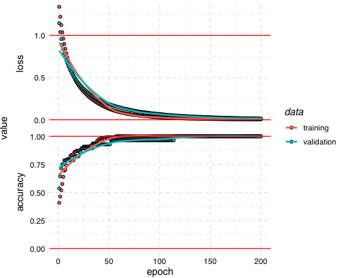
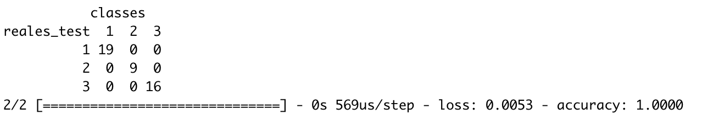
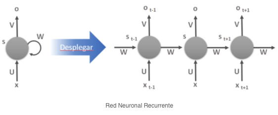

```{r}
library(flexdashboard)
library(shinydashboard)
library(shiny)
library(shiny)

knitr::opts_chunk$set(warning = FALSE, message = FALSE,cache=FALSE)

# Librerías base:
library(tidyverse)
library(magrittr)
library(ggpubr)
library(dplyr)

# Librerías lectura y escritura:
library(readr)

# Librerías para gráficos:
library(ggplot2)
library(plotly)
library(ggthemes)
library(gridExtra)
library(cowplot)
library(RColorBrewer)
library(scales)
library(treemapify)

# Librería tablas:
library(DT)
library(kableExtra)

# Librerías auxiliares:
library(lubridate)
library(forcats)
library(stringr)

```

# Piedra, papel o tijeras {data-navmenu="PIEDRA-PAPEL-TIJERAS"}

## Menu {.sidebar}{data-width=100}  

<div class="col">
<div>

<p class = "letra"> **PIEDRA, PAPEL o TIJERAS** </p>

Para jugar marcar uno de los **botones** disponibles abajo: <span class="marcar">**piedra**</span>, <span class="marcar">**papel**</span> o <span class="marcar">**tijeras**</span>.

Después de marcar una de las opciones, pulsar **JUGAR**.

<center>
{ width=10% }
{width=10%} 
{width=10%}
</center>
<br>

</div>

<div>

<p class = "letra"> **REGLAS:** </p>

El objetivo es vencer al oponente seleccionando la opción que gana según las siguientes reglas:

- La piedra aplasta la tijera. 

- La tijera corta el papel. 

- El papel envuelve la piedra. 

En caso de empate se juega otra vez.

</div>
</div>

*** 

La explicación de los algoritmos se encuentra en el apartado **Desarrollo del juego**.


### Juego

<div class="col">
<div>
```{r}
source("rps.R")

h3("Estrategia")
fluidPage(
  fluidRow(
    selectInput("algoritmo", h5("Algoritmo"),
                     choices = list("Aleatorio" = 1, 
                                    "Jugador ficticio" = 2,
                                    "Predictivo" = 3), selected = 1),
    helpText("Si seleccionas el algoritmo predictivo, indica cuantas filas previas quieres seleccionar."),
    numericInput("filas"," Filas del historial:", value = 50),
    actionButton(inputId = "papel",   label = "PAPEL",   class="button"),
    actionButton(inputId = "piedra",  label = "PIEDRA",  class="button"),
    actionButton(inputId = "tijeras", label = "TIJERAS", class="button")
  )
)
br()
fluidRow(column(3, align="center",
      actionButton("update", "JUGAR",class="button"),
      tags$style(type='text/css', 
        "#button { vertical-align- middle; height- 50px; width- 100%; font-size- 30px;}")))
# div(style="display:inline-block",actionButton("update", "JUGAR"))      
br()
htmlOutput("salida")

v<-reactiveValues(dato=NULL)
observeEvent(input$piedra,{v$dato<-"piedra"})
observeEvent(input$papel,{v$dato<-"papel"})
observeEvent(input$tijeras,{v$dato<-"tijeras"})

observeEvent(input$update,{
  
  # Algoritmo aleatorio
  if(input$algoritmo == "1"){
    
    RPS <- rps(v$dato) %>%
      unlist() %>%
      t() %>%
      as_tibble()  %>%
      mutate_at("utilidad", as.integer) %>%
      add_column(algoritmo = "aleatorio",
                 fecha = today())
    tabla <- read_csv("rps.csv",col_names = T,
                  col_types = cols(utilidad = col_integer(),
                                   fecha = col_date(format = "%Y-%m-%d")))
    tabla %<>% bind_rows(RPS)
    write_csv(tabla,"rps.csv")
    # Imprimir resultados
    output$salida <- renderUI({
      str1 <- paste( "Usted ha jugado: ",RPS$move)
      str2 <- paste( "El ordenador ha jugado: ", RPS$comp.move)
      str3 <- paste( "Resultado: ",RPS$estado)
      HTML(paste(str1, str2,str3, sep = '<br/>'))
    })
  }
  
  # Algoritmo jugador ficticio
  if(input$algoritmo == "2") {
      # Lectura del registro
      tabla <- read_csv("rps.csv",col_names = T, 
                        col_types = cols(utilidad = col_integer(),
                                         fecha = col_date(format = "%Y-%m-%d")))
      # Algoritmo
      jugador_fictio <- tabla %>%
        group_by(move) %>%
        dplyr::summarise(freq = n()/nrow(tabla)) %>% 
        filter(freq == max(freq))
      # Elección del ordenador.
      # Observación: se comtempla el caso de que dos alternativas tengan la misma frecuencia
      n = nrow(jugador_fictio)
      creencia_ordenador <- if(n>1){
        a = sample(n,1)
        jugador_fictio$move[a]
      } else {
        jugador_fictio$move
      }
      # El ordenador juega la estrategia que puede ganar a la creencia sobre el jugador
      if(creencia_ordenador == "tijeras"){comp.move <- "piedra"}
      if(creencia_ordenador == "papel"  ){comp.move <- "tijeras"}
      if(creencia_ordenador == "piedra" ){comp.move <- "papel"}
      # Evaluación de la partida
      evaluacion <- raw_rps(v$dato,comp.move) %>% 
        unlist()  %>%
        t() %>%
        as_tibble()  %>%
        mutate_at("utilidad", as.integer)
      # Nueva entrada
      nueva_fila <- tibble(
        move      = v$dato,
        comp.move = comp.move,
        estado    = evaluacion$estado,
        utilidad  = evaluacion$utilidad,
        fecha     = today(),
        algoritmo = "jugador ficticio"
      )
      # Añadir nueva entrada
      tabla %<>% bind_rows(nueva_fila)
      write_csv(tabla,"rps.csv")
      # Imprimir resultados
      output$salida <- renderUI({
        str1 <- paste( "Usted ha jugado: ",nueva_fila$move)
        str2 <- paste( "El ordenador ha jugado: ", nueva_fila$comp.move)
        str3 <- paste( "Resultado: ",nueva_fila$estado)
        HTML(paste(str1, str2,str3, sep = '<br/>'))
      })
  }
  

  # Algoritmo predictivo basado en cadenas de Markov
  if(input$algoritmo == "3") {
    # Lectura de la tabla
    tabla <- read_csv("rps.csv",col_names = T, 
                  col_types = cols(utilidad = col_integer(),
                                   fecha = col_date(format = "%Y-%m-%d")))
    estrategias <- c("piedra","papel","tijeras")
    # Modificamos la tabla
    DF <- tabla %>% 
      slice(tail(row_number(), input$filas)) %>% 
      mutate_if(is.character,factor) %>% 
      mutate(move      = fct_recode(move,      p = "papel", r = "piedra", s = "tijeras"),
             comp.move = fct_recode(comp.move, p = "papel", r = "piedra", s = "tijeras"),
             estado    = fct_recode(estado,    w = "gana",  d = "empate", l = "pierde")) %>%
      select(move:comp.move) %>% 
      mutate_if(is.factor,as.character)
    # la variable 'siguiente' representa la jugada a la que se mueve la partida en el siguiente estado
    DF <- DF %>% 
      mutate(siguiente = c(DF$move[-1], NA)) %>%
      unite("previo", move:comp.move, sep = "")
    # Guardamos el último registro, sobre este nos basaremos para elegir
    ultima_fila <- DF[nrow(DF),]
    DF <- DF[-nrow(DF),] %>% 
      dplyr::count(previo, siguiente) %>%
      mutate(celda = n / sum(n)) %>% 
      select(-n)
    # Creencia del ordenador
    if(!ultima_fila$previo %in% DF$previo){
      # Caso en el que la matriz no recoja el estado anterior
      a = sample(1:3,1)
      creencia_ordenador <- estrategias[a]
    } else{
      DF_eleccion <- DF %>%
        mutate(siguiente = factor(siguiente)) %>% 
        mutate(siguiente = fct_recode(siguiente, papel = "p", piedra = "r", tijeras = "s")) %>%
        mutate_at(vars(siguiente),as.character) %>% 
        filter(previo == ultima_fila$previo) %>% 
        filter(celda  == max(celda))
      
      if(nrow(DF_eleccion)>1){
        # Caso de que dos alternativas tengan la misma prob
        a = sample(DF_eleccion %>% nrow(),1)
        creencia_ordenador = DF_eleccion$siguiente[a]
      }else{
        creencia_ordenador = DF_eleccion$siguiente
      }
    }
    # El ordenador juega la estrategia que puede ganar a la creencia sobre el jugador
    if(creencia_ordenador == "tijeras"){comp.move <- "piedra"}
    if(creencia_ordenador == "papel"  ){comp.move <- "tijeras"}
    if(creencia_ordenador == "piedra" ){comp.move <- "papel"}
    # Por si acaso, si la creencia que tiene sobre el jugador es vacía entonces aleatoriza una estrategia
    if(is.na(creencia_ordenador)){comp.move <- sample(estrategias,1)}
    
    # Evaluación de la partida
    evaluacion <- raw_rps(v$dato,comp.move) %>% 
        unlist()  %>%
        t() %>%
        as_tibble()  %>%
        mutate_at("utilidad", as.integer)
    # Nueva entrada
    nueva_fila <- tibble(
        move      = v$dato,
        comp.move = comp.move,
        estado    = evaluacion$estado,
        utilidad  = evaluacion$utilidad,
        fecha     = today(),
        algoritmo = "predictivo"
    )
    # Añadir nueva entrada
    tabla %<>% bind_rows(nueva_fila)
    write_csv(tabla,"rps.csv")
    # Imprimir resultados
    output$salida <- renderUI({
        str1 <- paste( "Usted ha jugado: ",nueva_fila$move)
        str2 <- paste( "El ordenador ha jugado: ", nueva_fila$comp.move)
        str3 <- paste( "Resultado: ",nueva_fila$estado)
        HTML(paste(str1, str2,str3, sep = '<br/>'))
    })
  }
})
```
</div>
<div>
```{r}
h3("Últimas jugadas")
tableOutput("tabla")

datasetInput <- eventReactive(input$update, {
  tabla <- read_csv("rps.csv", col_names = T,
                  col_types = cols(utilidad = col_integer(),
                                   fecha    = col_character()))
  }, ignoreNULL = FALSE)

output$tabla <- renderTable({
    datasetInput() %>% tail()
})

```
</div>
</div>

# Gráficos {data-navmenu="PIEDRA-PAPEL-TIJERAS"}

Esta sección recoge una serie de gráficos para visualizar como los usuarios juegan a piedra, papel y tijeras en esta aplicación.

***

Los gráficos de esta sección se actualizan automáticamente conforme se juega.

```{r}

# GRÁFICOS
fluidPage(
  fluidRow(
    column(6,
           h3("Diagrama de sectores"),
           p("Representación de la proporción de los resultados obtenidos."),
           tabsetPanel(type = "tabs",
                  tabPanel("Total", plotOutput("sectores_total")),
                  tabPanel("Algoritmo aleatorio", plotOutput("sectores_aleatorio")),
                  tabPanel("Algoritmo jugador ficticio", plotOutput("sectores_ficticio")),
                  tabPanel("Algoritmo predictivo", plotOutput("sectores_predictivo"))),
           p("Se muestran los resultados sobre el total de partidas y según el algoritmo. El esfuerzo de ver por separado las proporciones cobra especial interés en el algoritmo aleatorio para osbervar si al intervenir el azar dichas proporciones se mantienen similares.")),
    column(6,
           h3("Uso de los algoritmos"),
           p("Representación de la preferencia de los usuarios por los distintos algoritmos."),
           br(),
           br(),
           plotOutput("alg"))
    ),
  br(),
  h5("Una vez seleccionado el algoritmo. ¿Cómo juegan los usuarios?."),
  fluidRow(
    h3("Estrategias ordenador vs jugador según algoritmo"),
    column(4,
           h5("Algoritmo aleatorio"),
           br(),
           br(),
           plotOutput("estrategia_1")),
    column(4,
           h5("Algoritmo jugador ficticio"),
          tabsetPanel(type = "tabs",
                  tabPanel("Regla jugador ficticio", plotOutput("estrategia_2")),
                  tabPanel("Total historial", plotOutput("estrategia")))),
    column(4,
           h5("Algoritmo predictivo"),
           br(),
           br(),
           plotOutput("estrategia_3"))
  ),
  br(),
  p("En el algoritmo aleatorio, la elección del ordenador es totalmente aleatoria, luego las frecuencias relativas debe mantenerse similares. De esta forma se puede distinguir también si al enfrentarse al algoritmo aleatorio los jugadores lo hacen de forma aleatoria (las frecuencias del jugador se mantendrían similares) o si está forzando una estrategia siempre, apareciendo esta con mayor frecuencia."),
  p("En el caso en el que los jugadores fuercen una estrategia determinada, esto se vería reflejado en la elección que hace el ordenador en el algoritmo jugador ficticio, eligiendo la estrategia que venza a la que los jugadores están forzando. Como para realizar esta elección se basa en la frecuencia del historial de partidos, se muestra en una pestaña las estrategias totales para comparar. Véase la pestaña Desarrollo del juego."),
  h3("Utilidad acumulada"),
  tabsetPanel(type = "tabs",
                  tabPanel("Total", plotOutput("paseo_total")),
                  tabPanel("Aleatorio", plotOutput("paseo_aleatorio"))),
  br(),
  p("Se muestra la utilidad acumulada en el historial de juego y en el caso aleatorio. El interés del caso aleatorio está en que si tanto ordenador como jugador eligen de forma aleatoria, la utilidad acumulada debe mantenerse entorno a cero ya que es un paseo aleatorio.  Véase la pestaña Desarrollo del juego."),
  br(),
  br(),
  h3("Comparación de algoritmos"),
  p("Muestra el número de victorias, empates y derrotas del jugador según algoritmos usando todo el historial. Se ha de tener en cuenta que las derrotas del jugador son las victorias del ordendor e igual con las victorias del ordenador."),
  fluidRow(
    column(3),
    column(5, align = "center",
           plotOutput("comparacion")),
    column(3),
  )
)
br()

mycols <- c("#0073C2FF", "#CD534CFF", "#EFC000FF")

## DIAGRAMAS DE SECTORES
### Sectores total
output$sectores_total <- renderPlot({
  df_sector <- datasetInput() %>% 
    group_by(estado) %>%
    tally() %>%
    mutate(freq = round(n / sum(n),3)) %>% 
    arrange(desc(estado)) %>%
    mutate(lab.ypos = cumsum(freq) - 0.5*freq)
  df_sector %>% 
    ggplot(aes(x = 2, y = freq, fill = estado)) +
    geom_bar(stat = "identity", color = "white") +
    coord_polar(theta = "y", start = 0) +
    geom_text(aes(y = lab.ypos, label = freq), color = "white") +
    scale_fill_manual(values = mycols) +
    theme_void() + xlim(0.5, 2.5)
})
### Sectores algoritmo aleatorio
output$sectores_aleatorio <- renderPlot({
  df_sector <- datasetInput() %>% 
    filter(algoritmo == "aleatorio") %>% 
    group_by(estado) %>%
    tally() %>%
    mutate(freq = round(n / sum(n),3)) %>% 
    arrange(desc(estado)) %>%
    mutate(lab.ypos = cumsum(freq) - 0.5*freq)
  df_sector %>% 
    ggplot(aes(x = 2, y = freq, fill = estado)) +
    geom_bar(stat = "identity", color = "white") +
    coord_polar(theta = "y", start = 0) +
    geom_text(aes(y = lab.ypos, label = freq), color = "white") +
    scale_fill_manual(values = mycols) +
    theme_void() + xlim(0.5, 2.5)
})
### Sectores algoritmo jugador ficticio
output$sectores_ficticio <- renderPlot({
  df_sector <- datasetInput() %>% 
    filter(algoritmo == "jugador ficticio") %>% 
    group_by(estado) %>%
    tally() %>%
    mutate(freq = round(n / sum(n),3)) %>% 
    arrange(desc(estado)) %>%
    mutate(lab.ypos = cumsum(freq) - 0.5*freq)
  df_sector %>% 
    ggplot(aes(x = 2, y = freq, fill = estado)) +
    geom_bar(stat = "identity", color = "white") +
    coord_polar(theta = "y", start = 0) +
    geom_text(aes(y = lab.ypos, label = freq), color = "white") +
    scale_fill_manual(values = mycols) +
    theme_void() + xlim(0.5, 2.5)
})
### Sectores algoritmo predictivo
output$sectores_predictivo <- renderPlot({
  df_sector <- datasetInput() %>% 
    filter(algoritmo == "predictivo") %>% 
    group_by(estado) %>%
    tally() %>%
    mutate(freq = round(n / sum(n),3)) %>% 
    arrange(desc(estado)) %>%
    mutate(lab.ypos = cumsum(freq) - 0.5*freq)
  df_sector %>% 
    ggplot(aes(x = 2, y = freq, fill = estado)) +
    geom_bar(stat = "identity", color = "white") +
    coord_polar(theta = "y", start = 0) +
    geom_text(aes(y = lab.ypos, label = freq), color = "white") +
    scale_fill_manual(values = mycols) +
    theme_void() + xlim(0.5, 2.5)
})


## USO DE ALGORITMOS
output$alg <- renderPlot({
datasetInput() %>% 
  group_by(algoritmo) %>% 
  tally() %>% 
  ggplot(aes(area = n,fill = n,label = algoritmo)) +
  geom_treemap(color = "red", fill = brewer.pal(n = 3, name = "Dark2")) +
  geom_treemap_text(fontface = "italic", colour = "white", 
                    place = "centre", grow = FALSE) +
  theme(legend.position = "none")
})


## ESTRATEGIAS
### Estrategias total
output$estrategia <- renderPlot({
  df_estrategia <- datasetInput() %>%
    pivot_longer(comp.move:move, names_to = "ente", values_to = "jugada") %>% 
    group_by(ente, jugada) %>%
    tally() %>% 
    mutate(freq = n/sum(n), Freq = ifelse(ente=="comp.move", -freq, freq))
  gg_1 <- df_estrategia %>% filter(ente == "comp.move") %>% 
    ggplot(aes(x = jugada, y = freq, fill = ente)) +
    geom_bar(stat = "identity", width = .85, alpha =.5, color = "red") + 
    labs(x = "", y = "", title = "Ordenador") + 
    scale_y_continuous('',  label = scales::percent_format(accuracy = 1), trans = "reverse") +
    scale_fill_manual(values = "blue") + theme_pander() +    
    theme(legend.position = 'none',
          axis.text.y = element_blank(),
          axis.ticks.y = element_blank(), 
          plot.title = element_text(size = 11.5),
          plot.margin=unit(c(0.1,0,0.1,0.05),"cm")) +
    coord_flip() 
  gg_2 <- df_estrategia %>% filter(ente == "move") %>% 
    ggplot(aes(x = jugada, y = freq, fill = ente)) +
    geom_bar(stat = "identity", width = .85, alpha =.5, color = "red") + 
    labs(x = "", y = "", title = "Jugador") +
    scale_y_continuous('', label = scales::percent_format(accuracy = 1)) +
    scale_fill_manual(values = "pink") + theme_pander() +
    theme(legend.position = 'none',
          axis.title.y = element_blank(),
          plot.title = element_text(size = 11.5),
          plot.margin=unit(c(0.1,0.2,0.1,-.1),"cm"),
          axis.ticks.y = element_blank(), 
          axis.text.y = theme_bw()$axis.text.y) + 
    coord_flip() 
  grid.arrange(gg_1,gg_2,ncol=2)
})
### Estrategias aleatorio
output$estrategia_1 <- renderPlot({ 
  df_estrategia <- datasetInput() %>%
    filter(algoritmo == "aleatorio") %>% 
    pivot_longer(comp.move:move, names_to = "ente", values_to = "jugada") %>% 
    group_by(ente, jugada) %>%
    tally() %>% 
    mutate(freq = n/sum(n), Freq = ifelse(ente=="comp.move", -freq, freq))
  gg_1 <- df_estrategia %>% filter(ente == "comp.move") %>% 
    ggplot(aes(x = jugada, y = freq, fill = ente)) +
    geom_bar(stat = "identity", width = .85, alpha =.5, color = "red") + 
    labs(x = "", y = "", title = "Ordenador") + 
    scale_y_continuous('',  label = scales::percent_format(accuracy = 1), trans = "reverse") +
    scale_fill_manual(values = "blue") + theme_pander() +    
    theme(legend.position = 'none',
          axis.text.y = element_blank(),
          axis.ticks.y = element_blank(), 
          plot.title = element_text(size = 11.5),
          plot.margin=unit(c(0.1,0,0.1,0.05),"cm")) +
    coord_flip() 
  gg_2 <- df_estrategia %>% filter(ente == "move") %>% 
    ggplot(aes(x = jugada, y = freq, fill = ente)) +
    geom_bar(stat = "identity", width = .85, alpha =.5, color = "red") + 
    labs(x = "", y = "", title = "Jugador") +
    scale_y_continuous('', label = scales::percent_format(accuracy = 1)) +
    scale_fill_manual(values = "pink") + theme_pander() +
    theme(legend.position = 'none',
          axis.title.y = element_blank(),
          plot.title = element_text(size = 11.5),
          plot.margin=unit(c(0.1,0.2,0.1,-.1),"cm"),
          axis.ticks.y = element_blank(), 
          axis.text.y = theme_bw()$axis.text.y) + 
    coord_flip() 
  grid.arrange(gg_1,gg_2,ncol=2)
})
## Estrategias regret matching
output$estrategia_2 <- renderPlot({ 
  df_estrategia <- datasetInput() %>%
    filter(algoritmo == "jugador ficticio") %>% 
    pivot_longer(comp.move:move, names_to = "ente", values_to = "jugada") %>% 
    group_by(ente, jugada) %>%
    tally() %>% 
    mutate(freq = n/sum(n), Freq = ifelse(ente=="comp.move", -freq, freq))
  gg_1 <- df_estrategia %>% filter(ente == "comp.move") %>% 
    ggplot(aes(x = jugada, y = freq, fill = ente)) +
    geom_bar(stat = "identity", width = .85, alpha =.5, color = "red") + 
    labs(x = "", y = "", title = "Ordenador") + 
    scale_y_continuous('',  label = scales::percent_format(accuracy = 1), trans = "reverse") +
    scale_fill_manual(values = "blue") + theme_pander() +    
    theme(legend.position = 'none',
          axis.text.y = element_blank(),
          axis.ticks.y = element_blank(), 
          plot.title = element_text(size = 11.5),
          plot.margin=unit(c(0.1,0,0.1,0.05),"cm")) +
    coord_flip() 
  gg_2 <- df_estrategia %>% filter(ente == "move") %>% 
    ggplot(aes(x = jugada, y = freq, fill = ente)) +
    geom_bar(stat = "identity", width = .85, alpha =.5, color = "red") + 
    labs(x = "", y = "", title = "Jugador") +
    scale_y_continuous('', label = scales::percent_format(accuracy = 1)) +
    scale_fill_manual(values = "pink") + theme_pander() +
    theme(legend.position = 'none',
          axis.title.y = element_blank(),
          plot.title = element_text(size = 11.5),
          plot.margin=unit(c(0.1,0.2,0.1,-.1),"cm"),
          axis.ticks.y = element_blank(), 
          axis.text.y = theme_bw()$axis.text.y) + 
    coord_flip() 
  grid.arrange(gg_1,gg_2,ncol=2)  
})
## Estrategias predictivo
output$estrategia_3 <- renderPlot({ 
  df_estrategia <- datasetInput() %>%
    filter(algoritmo == "predictivo") %>% 
    pivot_longer(comp.move:move, names_to = "ente", values_to = "jugada") %>% 
    group_by(ente, jugada) %>%
    tally() %>% 
    mutate(freq = n/sum(n), Freq = ifelse(ente=="comp.move", -freq, freq))
  gg_1 <- df_estrategia %>% filter(ente == "comp.move") %>% 
    ggplot(aes(x = jugada, y = freq, fill = ente)) +
    geom_bar(stat = "identity", width = .85, alpha =.5, color = "red") + 
    labs(x = "", y = "", title = "Ordenador") + 
    scale_y_continuous('',  label = scales::percent_format(accuracy = 1), trans = "reverse") +
    scale_fill_manual(values = "blue") + theme_pander() +    
    theme(legend.position = 'none',
          axis.text.y = element_blank(),
          axis.ticks.y = element_blank(), 
          plot.title = element_text(size = 11.5),
          plot.margin=unit(c(0.1,0,0.1,0.05),"cm")) +
    coord_flip() 
  gg_2 <- df_estrategia %>% filter(ente == "move") %>% 
    ggplot(aes(x = jugada, y = freq, fill = ente)) +
    geom_bar(stat = "identity", width = .85, alpha =.5, color = "red") + 
    labs(x = "", y = "", title = "Jugador") +
    scale_y_continuous('', label = scales::percent_format(accuracy = 1)) +
    scale_fill_manual(values = "pink") + theme_pander() +
    theme(legend.position = 'none',
          axis.title.y = element_blank(),
          plot.title = element_text(size = 11.5),
          plot.margin=unit(c(0.1,0.2,0.1,-.1),"cm"),
          axis.ticks.y = element_blank(), 
          axis.text.y = theme_bw()$axis.text.y) + 
    coord_flip() 
  grid.arrange(gg_1,gg_2,ncol=2)  
})


## UTILIDAD ACUMULADA
### Paseo total
output$paseo_total <- renderPlot({
  datasetInput() %>%
    ggplot(aes(x = 1:nrow(.), y = cumsum(utilidad))) +
    geom_point(color="navy") + 
    geom_line(color="cornflowerblue") +
    geom_smooth(color="red") +
    geom_hline(yintercept = 0) +
    xlab("Número de partida") + ylab("utilidad acumulada") +
    scale_x_continuous(breaks = seq(0, max(nrow(datasetInput())), 50)) +
    theme_pander() + theme(axis.text.x = element_text(angle = 90, hjust = 1))
})
### Paseo aleatorio
output$paseo_aleatorio <- renderPlot({
  datasetInput() %>%
    filter(algoritmo == "aleatorio") %>% 
    ggplot(aes(x = 1:nrow(.), y = cumsum(utilidad))) +
    geom_point(color="navy") + 
    geom_line(color="cornflowerblue") +
    geom_smooth(color="red") +
    geom_hline(yintercept = 0) +
    xlab("Número de partida") + ylab("utilidad acumulada") +
    scale_x_continuous(breaks = seq(0, max(nrow(datasetInput())), 50)) +
    theme_pander() + theme(axis.text.x = element_text(angle = 90, hjust = 1))
})


output$comparacion <- renderPlot({
  datasetInput() %>% 
    mutate_at(vars(estado),as.factor) %>% 
    group_by(algoritmo) %>% 
    count(estado) %>% 
    ggplot(aes(x = algoritmo, y = n, fill = fct_relevel(estado, c("gana","empate","pierde")))) +
    geom_col(position = "dodge") +  labs(fill = "estado") +
    scale_fill_manual(values = c("forestgreen","tan1","firebrick")) +
    theme_pander() 
})


```


# Desarrollo del juego {data-navmenu="PIEDRA-PAPEL-TIJERAS"}

Column {.tabset}
-------------------------------------

### Presentación

<h2 class='plate'> BOT <br> <span class='script'>PIEDRA-PAPEL-TIJERAS</span> </span></h2>

<center><h3> Alberto Torrejón Valenzuela </h3></center>
<center><h4> Universidad de Sevilla </h4></center>
<center><h4> Doble Grado Matemáticas y Estadística </h4></center>
<center><h4> Asignatura Inteligencia Artificial </h4></center>
<center><h5> <https://gitlab.com/albtorval/proyecto> </h5></center>

### Explicación del juego 

<center>
{ width=15% }
</center>

<p class = 'margen'> Aunque el **piedra-papel-tijera** (RPS) puede parecer un juego trivial, en realidad implica el difícil problema computacional del reconocimiento de patrones temporales. Este problema es fundamental para los campos de aprendizaje automático, inteligencia artificial y comprensión de datos. De hecho, incluso podría ser esencial para comprender cómo funciona la **inteligencia humana**. Debido a estas razones, el juego ha sido ampliamente investigado desde muchas áreas de conocimiento distintas: psicología, teoría de juego, toma de decisiones y la dinámica evolutiva, llegándose a obtener conclusiones relevantes en estos campos y extendiéndolas a otros como la biología o la economía. Además, hay varios concursos *open source*, todavía activos, que instan a crear modelos capaces de ganar, por ejemplo <a href = "http://www.rpscontest.com/">consurso python</a>.</p>

<h3 class = 'margen'><span class = 'letra'> Teoría de juegos </span></h3>

<h4 class = 'margen'><span class = 'letra'> Juegos simultáneos y equilibrio de Nash </span></h4>

<p class = 'margen'> Usando modelos de la **Teoría de juegos**, el piedra-papel-tijeras clásico es un juego <span class = "marcar" >simultáneo</span>, <span class = "marcar">bipersonal</span> y de <span class = "marcar">suma cero</span>. Existen otras modalidades más complejas como el *piedra, papel, tijeras, lagarto o spock*, que son simples extensiones del juego básico. Una vez clasificado el juego, recurrimos a los modelos de juegos estratégicos para dar una formalización de este. </p>

<p class = 'margen'> Un **juego estratégico** o **estático** se define formalmente como la terna $\Gamma =\langle N,A,u \rangle$ donde: </p>

<ul class = 'margen'>
  <li> $N = \{1,..,n\}$ conjunto no vacío de los $n$ **jugadores**.</li>
  <li> $A = A_1 \times ... \times A_n = \times_{i \in N} A_i$ conjunto de todas las posibles **acciones**.</li>
  <li> $u = (u_1,..,u_n)$ es el perfil de **funciones de utilidad**.</li>
</ul>

<p class = 'margen'> Cada $A_i$ representa el conjunto de acciones disponibles para el jugador $i$-ésimo. Sea $a = (a_1,...,a_n) \in A$ representa una combinación de las posibles acciones del juego, conocido como un perfil de acciones. Cada $u_i: A \longrightarrow \mathbb{R}$ representa la función de utilidad esperada del $i$-ésimo jugador si se da la combinación de acciones $a\in A$. En nuestro caso se tiene $N = \{1,2\}$ y $A_i = \{piedra, \ papel, \ tijeras\}$ para cada $i\in N$. No obstante, para analizar los juegos bipersonales, es suficiente dar la matriz que muestra los pagos por cada combinación de estrategias de los jugadores. La forma normal del juego es la siguiente:</p>

<center>
<table class="tg">
<thead>
  <tr>
    <th class="tg-ww11"></th>
    <th class="tg-gn06">Piedra</th>
    <th class="tg-gn06">Papel</th>
    <th class="tg-gn06">Tijeras</th>
  </tr>
</thead>
<tbody>
  <tr>
    <td class="tg-gn06">Piedra</td>
    <td class="tg-fybw">0,0</td>
    <td class="tg-fybw">-1,+1</td>
    <td class="tg-fybw">+1,-1</td>
  </tr>
  <tr>
    <td class="tg-gn06">Papel</td>
    <td class="tg-fybw">+1,-1</td>
    <td class="tg-fybw">0,0</td>
    <td class="tg-fybw">-1,+1</td>
  </tr>
  <tr>
    <td class="tg-gn06">Tijeras</td>
    <td class="tg-fybw">-1,+1</td>
    <td class="tg-fybw">+1,-1</td>
    <td class="tg-fybw">0,0</td>
  </tr>
</tbody>
</table>
</center>

<br>

<p class = 'margen'> Una **estrategia** es la planificación que sigue un jugador para elegir entre sus posibles alternativas. Es una regla predeterminada que especifica por completo cómo se intenta responder a cada posible circunstancia en cada etapa del juego. </p>

<p class = 'margen'> En un principio, se distinguen dos tipos principales de estrategias: </p>

<ul class = 'margen'>
<li> **Estrategia pura:** son aquellas en las que no interviene la probabilidad, sino que las elecciones son libres del jugador. </li>
<li> **Estrategia mixta:** son aquellas en las que interviene la probabilidad. </li>
</ul>

<p class = 'margen'> Para los juegos estratégicos existe una forma *racional* de jugar a todo juego. A esta forma se llega analizando el conocido como **equilibrio de Nash** del juego. La búsqueda del equilibrio de Nash *puro* en el piedra-papel-tijeras nos permitiría tener una estrategia óptima con la que jugar siempre, pero no todos los juegos tiene equilibrio en estrategias puras, como es el caso del juego que nos ocupa. Esto hace que tengamos que recurrir a estrategias mixtas, teniendo que especificar una distribución de probabilidad sobre las acciones, lo que dificulta la resolución del juego ya que carácter aleatorio de este es muy fuerte. El modo de juego aleatorio se explica en `Algoritmo aleatorio`.</p>

<h4 class = 'margen'><span class = 'letra'> Juegos repetidos y aprendizaje </h4></span>

<p class = 'margen'> Las personas pueden comportarse de manera diferente con aquellos con quienes esperan tener una relación a largo plazo que con aquellos con quienes no esperan una interacción futura. Para comprender cómo el comportamiento racional e inteligente puede verse afectado por la estructura de una relación a largo plazo, estudiamos los **juegos repetidos**. </p>

<p class = 'margen'> El factor *repetición* permite la posibilidad de obtener conocimientos sobre la estructura del juego en el transcurso de este. En el proyecto hemos supuesto que la forma de aprender en el juego es llevando un registro de todos los juegos que se han disputado. La regla de apredizaje conocida como **jugador ficticio** es la base del algoritmo que se explica en `Algoritmo jugador ficticio`.</p>

<h3 class = 'margen'> <span class = 'letra'> Otros enfoques </span> </h3>

<p class = 'margen'> Hay dos enfoques generales para el juego RPS, la aleatoriedad de equilibrio de Nash y la evolución circular. </p>

<h4 class = 'margen'> <span class = 'letra'>Factor psicológico </span> </h4> 

<p class = 'margen'> Uno de los <a href = "https://arxiv.org/pdf/1404.5199v1.pdf">últimos artículos</a> más relevantes en el estudio del juego del piedra-papel-tijeras señala el papel de la psicología en ganar (o perder) en piedra, papel o tijera. Después de estudiar cómo los jugadores cambian o mantienen sus estrategias durante las sesiones de varias rondas, descubrieron una regla básica por la cual las personas tienden a jugar que podría ser explotada. Esta regla es la siguiente: </p>

<p class= 'margen'> *Si pierde la primera ronda, cambie a lo que supera a lo que acaba de jugar su oponente. Si ganas, no sigas jugando lo mismo, sino cambia a lo que ganaría a lo que acabas de jugar.* </p>

<h4 class = 'margen'><span class = 'letra'> Aprendizaje por refuerzo </span></h4> 

<p class = 'margen'> El **aprendizaje por refuerzo**, o aprendizaje reforzado, es un área del aprendizaje automático cuya ocupación es determinar qué acciones debe escoger un agente de software en un entorno dado con el fin de maximizar alguna noción de "recompensa" o premio acumulado. Generalmente este aprendizaje se canaliza como un proceso de decisión de Markov (MDP). Como se dice en <a href = 'https://es.wikipedia.org/wiki/Cadena_de_M%C3%A1rkov'>Wikipedia</a>, una **cadena de Markov** es un modelo estocástico que describe una secuencia de posibles eventos en los que la probabilidad de cada evento depende solo del estado alcanzado en el evento anterior. En el juego piedra-papel-tijeras, si llevamos un registro de las partidas, podemos analizar la probabilidad con la que dado un estado del juego (jugador: *tijeras*, ordenador: *piedra*, estado: *pierde*) se pasa al siguiente estado.</p>

<p class = 'margen'> En estos dos últimos enfoques nos hemos basado para describir el algoritmo que se explica en `Algoritmo predictivo`.</p>

<h3 class = 'margen'><span class = 'letra'> Un modelo para predicir el resultado </span></h3> 

<p class = 'margen'> En el último apartado, `Aplicación de modelos`, no nos centramos en la creación de una regla que permita al ordenador elegir una de las estrategias de forma fundamentada. Nos ocupamos, con ayuda del paquete `tidymodels`, de elaborar un modelos que dado los movimientos del jugador y del ordenador nos muestre el resultado de la partida. Este acercamiento puede parecer trivial, y lo es, pero tiene una ventaja, la elaboración de un modelo predictivo sobre el resultado nos permitiría no tener que preocuparnos de programar el juego de piedra-papel-tijeras, a pesar de su sencillez, pudiendo basarnos en este modelo para obtener el resultado del juego. Esta idea, que no se ha implementado en el bot, se muestra y desarrolla obteniendo dicho modelo. </p>

<br>
<br>

### Algoritmo aleatorio

<p class = 'margen'> Al jugar varias rondas de RPS contra el mismo oponente, es posible intentar predecir qué hará el oponente para obtener una ventaja. Sin embargo, es imposible obtener una ventaja contra un oponente que está jugando completamente al azar. </p>

<h3 class = 'margen'><span class = 'letra'> Código </span></h3> 

<p class = 'margen'> Como la implementación del jugador aleatorio de piedra-papel-tijeras vamos a aprovechar para explicar también el código de evaluación del juego. Se ha creado una función `rps` en un script a parte al que se accede a través de la llamada con `source`.</p>

<div class = 'margen'>
```{r, echo=TRUE, eval=FALSE}
rps = function(move){  
  
  options = c("piedra","papel","tijeras")
  comp.move = sample(options, size = 1)
  
  estado = NULL
  if(move == "piedra"  & comp.move == "piedra")   estado = "empate"
  if(move == "piedra"  & comp.move == "tijeras")  estado = "gana"
  if(move == "piedra"  & comp.move == "papel")    estado = "pierde"
  if(move == "papel"   & comp.move == "papel")    estado = "empate"
  if(move == "papel"   & comp.move == "tijeras")  estado = "pierde"
  if(move == "papel"   & comp.move == "piedra")   estado = "gana"
  if(move == "tijeras" & comp.move == "tijeras")  estado = "empate"
  if(move == "tijeras" & comp.move == "piedra")   estado = "pierde"
  if(move == "tijeras" & comp.move == "papel")    estado = "gana"
  
  utilidad = NULL
  if (estado == "empate") utilidad = 0
  if (estado == "pierde") utilidad = -1
  if (estado == "gana")   utilidad = 1
  
  lista = list(move = move, 
               comp.move=comp.move, 
               estado=estado,
               utilidad = utilidad) 
  
  lista
}
```
</div>

<p class = 'margen'> Para guardar los datos en un registro en formato `csv` simplemente se utiliza el siguiente código donde `RPS` representa la evaluación del juego llamando a la función anterior. </p>

<div class = 'margen'>
```{r echo=TRUE, eval=FALSE}
library(tidyverse)
library(magrittr)
library(readr)
tabla <- read_csv("rps.csv", col_names = T, col_types = cols(utilidad = col_integer(),
                                                                    fecha = col_date(format = "%Y-%m-%d")))
tabla %<>% bind_rows(RPS)
write_csv(tabla,"rps.csv")
```
</div>

<p class = 'margen'>De esta forma estamos cargando el archivo csv, pegando las filas con la nueva evaluación del juego y sobreescribiendo el archivo csv permitiendo llevar un historial de jugadas que nos será muy útil para los algoritmos sucesivos.</p>

<h4 class = 'margen'><span class = 'letra'> Comentarios sobre los gráficos </span></h4> 

<p class = 'margen'> Al ser las elecciones supuestamente aleatorias debemos observar que las proporciones de **victorias**, **empates** y **derrotas** deben de mantenerse similares en los `diagramas de sectores`. Por otra parte los porcentajes de la elección de estrategias en el gráfico `Estrategias ordenador vs jugador` deben mantenerse también similares. De esta forma se puede distinguir si al enfrentarse al algoritmo aleatorio los jugadores lo hacen de forma aleatoria (las frecuencias del jugador se mantendrían similares) o si está forzando una estrategia siempre, apareciendo esta con mayor frecuencia. </p>

<p class = 'margen'> Por último, se muestra la utilidad acumulada en el historial de juego y en el caso aleatorio. El interés del caso aleatorio está en que si tanto ordenador como jugador eligen de forma aleatoria, la utilidad acumulada debe mantenerse entorno a cero ya que es un paseo aleatorio. </p>

<p class = 'margen'> Un **paseo aleatorio** (continuo) es un *proceso estocástico* que viene dado por el siguiente modelo </p>

$$X_{t+1}=X_t+Z_t$$
<p class = 'margen'> donde $Z_t$ son independientes e idénticamente distribuidas según una determinada función de densidad $g$ y también son independientes de $X_0$. De nuevo, si esta propiedad no se cumpliese podríamos estar en el supuesto en el que hay alguien que no está aleatorizando del todo sus etrategias y por lo tanto sería interesante construir modelos que supongan comportamientos no aleatorios del jugador, como son `Algoritmo jugador ficticio` y `Algoritmo predictivo`. </p>

<br>
<br>

### Algoritmo jugador ficticio 

<h3 class = 'margen'><span class = 'letra'> Regla de aprendizaje del jugador ficticio </span></h3> 

<p class = 'margen'>El **juego ficticio** (*ficticious play*) es una algoritmo de aprendizaje introducido por
primera vez por George W. Brown. En cada ronda, cada jugador responde mejor a la frecuencia empírica de juego de su oponente. Tal método es, por supuesto, adecuado si el oponente usa una estrategia estacionaria, mientras que es ineficaz si la estrategia del oponente no es estacionaria. La estrategia del oponente puede, por ejemplo, estar condicionada al último movimiento del jugador ficticio.</p>

<p class = 'margen'>**Algoritmo juego ficticio.**</p>

<ul class = 'margen'>
<li> Inicializar creencias sobre las estrategias del oponente. Cada turno:

  - Juega la mejor respuesta a la estrategia evaluada del oponente.
  - Observar el juego real del oponente y actualizar las creencias en consecuencia.
</li>
</ul>

<p class = 'margen'>Formalmente, sea $w(a)$ el número de veces que el oponente ha jugado la acción $a\in A$. Estos valores se pueden inicializar a valores iniciales distintos de cero, que podrían representar las **creencias** sobre el oponente. La estrategia del oponente es evaluada usando las frecuencias y se computa la estrategia mixta con probabilidades proporcionales: </p>

$$\sigma(a) = \frac{w(a)}{\sum_{a'\in A}w(a')}.$$
<p class = 'margen'> Finalmente se elige la estrategia pura que mejor responde a la estrategia evaluada. Esta regla nos permitirá ganar al detectar patrones en casos especiales, por ejemplo en aquellos en los que el jugador elige repetidamente la misma acción. </p>

<h3 class = 'margen'><span class = 'letra'> Código </span></h3> 

<p class = 'margen'> Primero debemos cargar el historial de jugadas disponible.  </p>

<div class = 'margen'>
```{r echo=TRUE}
library(tidyverse)
library(readr)
tabla <- read_csv("rps.csv", col_names = T, col_types = cols(utilidad = col_integer(),
                                                                 fecha    = col_date(format = "%Y-%m-%d")))
```
</div>

<p class = 'margen'> A continuación calculamos la frecuencia de las jugadas del jugador del historial en la que basaremos nuestra decisión. </p>

<div class = 'margen'>
```{r echo=TRUE}
frec <- tabla %>%
  group_by(move) %>%
  dplyr::summarise(freq = n()/nrow(tabla))
frec
```
</div>

<p class = 'margen'> Nos quedamos con la alternativa que presente mayor frecuencia. Esta será la creencia que el ordenador tiene sobre el movimiento del jugador. En el caso de que dos alternativas tengan la misma frecuencia se obtiene una de forma aleatoria. </p>

<div class = 'margen'> 
```{r echo=TRUE, eval=FALSE}
jugador_ficticio <- frec %>% filter(freq == max(freq))
n = nrow(jugador_fictio)
creencia_ordenador <- 
  if(n>1){
    a = sample(n,1)
    jugador_fictio$move[a]
  } else {
    jugador_fictio$move
  }
```
</div>

<p class = 'margen'> El ordenador juega la estrategia que puede ganar a la creencia sobre el jugador. </p>

<div class = 'margen'> 
```{r echo=TRUE, eval=FALSE}
if(creencia_ordenador == "tijeras"){comp.move <- "piedra"}
if(creencia_ordenador == "papel"  ){comp.move <- "tijeras"}
if(creencia_ordenador == "piedra" ){comp.move <- "papel"}
```
</div>

<p class = 'margen'> Por último se evalúa la partida, se crea una nueva entrada que se añade al historial y sobreescribimos el archivo csv.</p>

<div class = 'margen'> 
```{r echo=TRUE, eval=FALSE}
# Evaluación de la partida
evaluacion <- rps(move,comp.move) %>% 
  unlist()  %>% 
  t() %>%
  as_tibble()  %>%
  mutate_at("utilidad", as.integer)
# Nueva entrada
nueva_fila <- tibble(
  move      = move,
  comp.move = comp.move,
  estado    = evaluacion$estado,
  utilidad  = evaluacion$utilidad,
  fecha     = today(),
  algoritmo = "jugador ficticio"
)
# Añadir nueva entrada
tabla %<>% bind_rows(nueva_fila)
write_csv(tabla,"rps.csv")
```
</div>

<p class = 'margen'> Al actualizarse el historial, en la nueva ronda del juego tendremos las frecuencias actualizadas y por lo tanto las creencias del ordenador se actualizarán. </p>

<h4 class = 'margen'><span class = 'letra'> Consideraciones sobre el algoritmo </span></h4> 

<p class = 'margen'> En este caso se ha basado el análisis de frecuencias en el historial entero. Esto supone que para advertir que un jugador elige siempre una misma estrategia, hecho que suele ser más frecuente de lo normal y sobre todo en aplicaciones como esta donde los jugadores entrenan al bot, hace falta que el jugador repita un número considerable de veces la misma estrategia. Es decir, el algoritmo tarda en detectar los cambios si el historial es muy largo. Por esta razón los resultados que arroja el algoritmo no son buenos en general. </p>

<p class = 'margen'> Una solución a este problema es la que se plantea para el `Algoritmo predictivo`, permitir que el jugador elija el número de filas previas sobre las cuales el ordenador basa la actualización de las frecuencias. Un número menor de filas supone que el bot reconozca los patrones de conducta antes y mejora la eficiencia del algoritmo. Se ha preferido centrar el esfuerzo en desarrollar en profundidad esta idea en el siguiente algoritmo por lo que esta opción no se implementa en el algoritmo del jugador ficticio. </p>

<h4 class = 'margen'><span class = 'letra'> Comentarios sobre los gráficos </span></h4> 

<p class = 'margen'> Al basar la actualización de las frecuencias en el historial completo, en el caso en el que los jugadores fuercen una estrategia determinada, esto se vería reflejado en la elección que hace el ordenador en el algoritmo jugador ficticio, que se puede visualizar en el gráfico de `estrategias ordenador vs jugador`, eligiendo la estrategia que venza a la que los jugadores están forzando (aunque esto puede tardar en advertirse como se comenta en el punto anterior). </p>

<br>

### Algoritmo predictivo 

<h3 class = 'margen'><span class = 'letra'> Algoritmo predictivo basado en procesos de Markov </span></h3> 

<p class = 'margen'> La <a href= "http://halweb.uc3m.es/esp/Personal/personas/jmmarin/esp/PEst/tema4pe.pdf">cadena de Markov</a> de tiempo discreto más simple es la cadena de Markov de primer orden, donde la probabilidad de pasar al siguiente estado depende solo del estado actual y no de los estados anteriores: </p>

$$ Pr(X_{n+1} = x |\ X_1 = x_1, X_2 = x_2, ..., X_n = x_n) =  Pr(X_{n+1} = x | \ X_n = x_n)$$
<p class= 'margen'> donde $X_1, X_2, ...$ son una secuencia de variables aleatorias, para nosotros generadas por el juego piedra-papel-tijeras. Lo que jugarás en la próxima ronda solo depende de lo que jugaste esta ronda, como una secuencia de patrón de memoria corta. </p>

<p class = 'margen'> Las cadenas de Markov se pueden generalizar a casos de dependencia a corto plazo, teniendo en cuenta los estados pasados recientes en la cadena. La cadena de Markov de orden $m$ considera que el estado actual depende de $m$ estados anteriores, donde $m$ es finito y es un proceso que satisface </p>

$$ Pr(X_{n} = x_n |\ X_{n-1} = x_{n-1}, X_{n-2} = x_{n-2}, ..., X_1 = x_1) =  Pr(X_n = x_n |\ X_{n-1} = x_{n-1}, X_{n-2} = x_{n-2}, ..., X_{n-m} = x_{n-m}) \quad \text{para} \ n>m$$
<p class = 'margen'> Para $n<m$, todos los modelos de cadena de Markov de orden $m$-ésima seleccionarán Piedra, Papel, Tijera al azar, con 1/3 de probabilidad cada uno, lo que coincide con la estrategia a la que se llegaría al computar el equilibrio mixto de Nash del juego. </p>

<p class = 'margen'> La forma de actualizar estas probabilidades en nuestro caso es, en cada ronda, observar la frecuencia con la que dada una elección de las estrategias de los jugadores (ordenador: *tijeras*, jugador: *tijeras*) se pasa a que el jugador elija otra estrategia en la siguiente ronda, de forma que este algoritmo recoge la esencia subyacente en las cadenas de Markov y propone basar la decisión final en la actualización de las probabilidades de transición, véase este <a href="https://arxiv.org/pdf/2003.06769.pdf">artículo</a>. La respuesta del ordenador será aquella que mejor responda a la estrategia del jugador que mayor probabilidad de transición tenga. </p>

<h3 class = 'margen'><span class = 'letra'> Código </span></h3> 

<p class = 'margen'> Se empleará el paquete `tidyverse` para realizar las transformaciones pertinentes. Para usar el historial leemos el archivo csv en el que se han apoyando los cálculos. El número de filas a usar en el procedimiento es un valor input.</p>

<div class = 'margen'> 
```{r echo=TRUE}
tabla <- read_csv("rps.csv", col_names = T, col_types = cols(utilidad = col_integer(),
                                                                 fecha    = col_date(format = "%Y-%m-%d")))

# Vector especificando las estrategias
estrategias <- c("piedra","papel","tijeras")

# Número de filas previas del historial
filas <- 50
```
</div>

<p class = 'margen'> Para poder estudiar la transición de un estado a otro necesitamos modificar nuestro registro usando una notación distinta. Así, $p \equiv papel$, $r \equiv piedra$ y $s \equiv tijeras$. La notación $rp$ siginifica que se ha jugado en esa ronda *piedra vs papel*. </p>

<div class = 'margen'> 
```{r echo=TRUE}
DF <- tabla %>% 
  slice(tail(row_number(), filas)) %>% # selección últimas filas
  mutate_if(is.character,factor) %>% 
  mutate(move      = fct_recode(move,      p = "papel", r = "piedra", s = "tijeras"),
         comp.move = fct_recode(comp.move, p = "papel", r = "piedra", s = "tijeras"),
         estado    = fct_recode(estado,    w = "gana",  d = "empate", l = "pierde")) %>%
  select(move:comp.move) %>% # nos quedamos con las variables que indican la estrategia
  mutate_if(is.factor,as.character)
```
</div>

<p class = 'margen'> Necesitamos una variable que muestre, según la notación anterior, las estrategias anteriores (que se unen en una misma columna con la función `unite`) y el estado del jugador al que se pasa. También guardaremos la última fila de la cual se desconoce el estado al que pasa, es lo que queremos observar. </p>

<div class = 'margen'> 
```{r echo=TRUE}
DF <- DF %>% 
  mutate(siguiente = c(DF$move[-1], NA)) %>%
  unite("previo", move:comp.move, sep = "")

DF %>% head()

# Guardamos el último registro, sobre este nos basaremos para elegir
ultima_fila <- DF[nrow(DF),]
ultima_fila
```
</div>

<p class = 'margen'> Cálculamos las frecuencias agrupando por *previo* y *siguiente*. </p>

<div class = 'margen'> 
```{r echo = TRUE}
DF <- DF[-nrow(DF),] %>% #eliminamos la última fila 
  dplyr::count(previo, siguiente) %>%
  mutate(celda = n / sum(n)) %>% 
  select(-n)

```
</div>

<p class = 'margen'> Para visualizar las probabilidades de transición podemos calcular la matriz siguiente, similar a la matriz de transición de estados de las cadenas de Markov. </p>

<div class = 'margen'> 
```{r echo = TRUE}
matriz <- DF %>% 
  spread(previo, celda)  %>%
  column_to_rownames(var="siguiente") %>%
  as.matrix() %>% t() %>% round(3)

matriz
```
</div>

<p class = 'margen'> Vemos cuál es el estado más probable al que se puede mover la última fila que hemos guardado anteriormente. Si ocurre que el estado de la última fila no está recogido en la matriz de transición (cosa que ocurre por ejemplo si tomamos muy pocos registros como memoria), el ordenador aleatoriza una estrategia. </p>

<div class = 'margen'> 
```{r echo = TRUE, eval = FALSE}
# Creencia del ordenador
if(!ultima_fila$previo %in% DF$previo){
  # Caso en el que la matriz no recoja el estado anterior
  a = sample(1:3,1)
  creencia_ordenador <- estrategias[a]
} else{
  DF_eleccion <- DF %>%
    mutate(siguiente = factor(siguiente)) %>% 
    mutate(siguiente = fct_recode(siguiente, papel = "p", piedra = "r", tijeras = "s")) %>%
    mutate_at(vars(siguiente),as.character) %>% 
    filter(previo == ultima_fila$previo) %>% 
    filter(celda  == max(celda))
  
  if(nrow(DF_eleccion)>1){
    # Caso de que dos alternativas tengan la misma prob
    a = sample(DF_eleccion %>% nrow(),1)
    creencia_ordenador = DF_eleccion$siguiente[a]
  }else{
    creencia_ordenador = DF_eleccion$siguiente
  }
}
```
</div>

<p class = 'margen'> El ordenador juega la estrategia que puede ganar a la creencia sobre el jugador. Si la creencia que tiene sobre el jugador es vacía entonces aleatoriza una estrategia.</p>

<div class = 'margen'> 
```{r echo = TRUE, eval=FALSE}
if(creencia_ordenador == "tijeras"){comp.move <- "piedra"}
if(creencia_ordenador == "papel"  ){comp.move <- "tijeras"}
if(creencia_ordenador == "piedra" ){comp.move <- "papel"}
if(is.na(creencia_ordenador)){comp.move <- sample(estrategias,1)}
```
</div>

<p class = 'margen'> Por último se evalúa la partida, se crea una nueva entrada que se añade al historial y sobreescribimos el archivo csv.</p>

<div class = 'margen'> 
```{r echo=TRUE, eval=FALSE}
# Evaluación de la partida
evaluacion <- rps(move,comp.move) %>% 
  unlist()  %>% 
  t() %>%
  as_tibble()  %>%
  mutate_at("utilidad", as.integer)
# Nueva entrada
nueva_fila <- tibble(
  move      = move,
  comp.move = comp.move,
  estado    = evaluacion$estado,
  utilidad  = evaluacion$utilidad,
  fecha     = today(),
  algoritmo = "predictivo"
)
# Añadir nueva entrada
tabla %<>% bind_rows(nueva_fila)
write_csv(tabla,"rps.csv")
```
</div>

<p class = 'margen'> Al actualizarse el historial, en la nueva ronda del juego tendremos las probabilidades de transición actualizadas y por lo tanto las creencias del ordenador se actualizarán. </p>

<h4 class = 'margen'><span class = 'letra'> Detección de patrones y tamaño de la memoria </span></h4> 

<p class = 'margen'> Este algoritmo *predictivo* permite reconocer muchos patrones de comportamiento de los jugadores. La posibilidad de elegir el número de filas que usamos del historial nos deja jugar con el tamaño de la memoria que usa nuestro algoritmo para la actualización de las probabilidades de transición. De esta forma, si usamos muchos registros, la memoria de nuestro bot será amplia y fundamentará su decisión en un conocimiento de todos los jugadores pasados. Por el contrario, si nuestra memoria es reducida, el algoritmo será capaz de reconocer patrones muy fuertes en poco tiempo. Por ejemplo se puede comprobar qué pasa y cuánto tarda en advertir el patrón de elección del rival según el tamaño de la memoria en los siguientes casos: </p> 

<ul class = 'margen'>
<li> Jugar siempre la misma estrategia. </li>
<li> Jugar primero piedra, luego papel y por último tijeras. Repetir el ciclo. </li>
<li> Jugar alguna combinación de las estrategias anteriores. </li>
</ul>

<h4 class = 'margen'><span class = 'letra'> Observación </span></h4> 

<p class = 'margen'> Durante la construcción del método se observó que al responder con <span class = 'marcar'>la misma estrategia</span> que el ordenador genera como creencia al último estado del historial actualizando las probabilidades de transición de estados supone una mejora considerable en el algoritmo. </p>

<br>

### Aplicación de modelos 

<h3 class = 'margen'><span class = 'letra'> Un modelo para predecir el resultado del juego </span></h3> 

<p class = 'margen'> En este apartado vamos a aplicar los principios que recoge el paquete <a href = "https://www.tidymodels.org/">`tidymodels`</a> para generar un modelo de clasificación en el que dado las elecciones del piedra, papel o tijeras de jugador y ordenador podamos predecir el resultado final de la ronda.  </p>

<center>
{ width=15% }
</center>

<p class = 'margen'>  Este acercamiento puede parecer trivial, y lo es, pero tiene una ventaja, la elaboración de un modelo predictivo sobre el resultado nos permitiría no tener que preocuparnos de programar el juego de piedra-papel-tijeras una vez entrenado nuestro modelo, a pesar de que el código de evaluación dados los movimmientos es sencillo. Este acercamiento se puede implementar en juegos con reglas más complicadas si se consigue ajustar un modelo **sin** errores de clasficación, lo que es complicado en la realidad, como veremos en el *VNM-Póker*. </p>

<p class = 'margen'> El flujo que seguiremos se resume en el siguiente esquema. </p>

<center>
{ width=25% }
</center>

<p class = 'margen'> Existen muchas otras utilidades de este paquete, como el tunning de parámetros, de las cuales no vamos a hacer uso para analizar los datos que proporciona el registro que hemos acumulado del juego, los parámetros que se seleccionarán son los predeterminados. Debido a la simplicidad de la conclusión que deseamos obtener, el modelo que obtendremos será muy bueno con poco entrenamiento, permitiendo que si se desease implementar el modelo como evaluación del resultado no supusiese un coste computacional alto.</p>

<h3 class = 'margen'><span class = 'letra'> Código </span></h3> 

<div class = 'margen'>
```{r echo= TRUE}
library(tidyverse)
library(tidymodels)

# Datos
dataset <- read_csv("rps.csv", col_names = T, col_types = cols(utilidad = col_integer(),
                                                               fecha    = col_character()))

```
</div>

<h4 class = 'margen'><span class = 'letra'> Preprocesamiento y partición del conjunto de datos </span></h4> 

<p class = 'margen'> En primer lugar nos deshacemos de las variables que pueden distorsionar nuestro modelo.  </p>

<div class = 'margen'>
```{r echo = TRUE}
RPS <- dataset %>% 
  select(estado,comp.move,move) %>% 
  mutate_if(is.character,factor) #importante pasar a factor
```
</div>

<p class = 'margen'> La partición de los datos se hace llamando a la función `initial_split`. Usamos la orden `strata` para realizar un muestreo estratificado por la variable estado. </p>

<div class = 'margen'>
```{r echo = TRUE}
set.seed(123)
RPS.split <- initial_split(RPS, strata = estado, breaks = 4)
RPS.train <- RPS.split %>% training()
RPS.test  <- RPS.split %>% testing()
```
</div>

<p class = 'margen'> Vamos a construir una receta, con la función `recipe` para terminar de transformar nuestros datos. Debemos pasar todos aquellos variables nominales que no son variables objetivo a variables dummy que podamos tratar numéricamente, aunque realmente para los modelos que usaremos no es necesario. Los árboles pueden manejar tanto predictores cuantitativos como cualitativos sin tener que crear variables dummy, se hace por el interés académico. La orden `prep` activa la aplicación de los cambios que le hemos indicado. </p>

<div class = 'margen'>
```{r echo = TRUE}
RPS.receta <- recipe(estado ~ ., data = RPS.train) 
RPS.receta.prep <- RPS.receta %>%
  step_dummy(all_nominal(),-all_outcomes()) %>% 
  prep()
RPS.receta.prep
```
</div>

<p class = 'margen'> Para ver los datos tranformados podemos llamar a las funciones `juice` y `bake`. </p>

<div class = 'margen'>
```{r echo = TRUE}
# Sobre los datos de entrenamiento
RPS.train.trans <- juice(RPS.receta.prep)
# Sobre los datos de test
RPS.test.trans <- bake(RPS.receta.prep,RPS.test)
```
</div>

<h4 class = 'margen'><span class = 'letra'> Entrenamiento de modelos </span></h4> 

<p class = 'margen'> Las funciones necesarias para especificar, construir y ajustar distintos modelos se encuentran en el paquete <a href = "https://www.tidymodels.org/find/#search-parsnip-models">`parnsip`</a>. Vamos a comparar los resultados que obtenemos ajustando un modelo de árboles aleatorios, `rand_forest`. Otros modelos interesantes a considerar son la regresión logística, `logistic_reg`, k vecinos cercanos, `nearest_neighbor`, con por ejemplo distancia de Hamming si no queremos transformar los datos, o el clasificador bayesiano, `naive_Bayes`.</p>

<div class = 'margen'>
```{r echo = TRUE}
library(randomForest)

rf_model <- rand_forest() %>%
  set_engine("randomForest") %>%
  set_mode("classification") 

# Llamada para un modelo de regresión logística:
# lr_model <- logistic_reg() %>%
#   set_engine("glm") %>%
#   set_mode("classification") 

# Llamada para un modelo de vecinos cercanos:
# kn_model <- nearest_neighbor() %>% # para kknn se debe normalizar
#   set_engine("kknn") %>% 
#   set_mode("classification")

```
</div>

<p class = 'margen'> Construimos un `workflow` para facilitar el flujo de trabajo al que indicamos el modelo y la receta. </p>

<div class = 'margen'>
```{r echo = TRUE}
rf_wf <- workflow() %>%
  add_model(rf_model) %>%
  add_recipe(RPS.receta.prep)
```
</div>

<p class = 'margen'> Evaluamos el modelo en el conjunto test con la orden `last_fit`. </p>

<div class = 'margen'>
```{r echo = TRUE}
RPS.last.fit <- rf_wf %>% last_fit(RPS.split)
```
</div>

<p class = 'margen'> Si queremos emplear validación cruzada en 10 plieges basta llamar a la función `vfol_cv` y por último ajustar el modelo con  `fit_resample`.</p>

<div class = 'margen'>
```{r echo = TRUE, eval=FALSE}
set.seed(234)
RPS.cv <- vfold_cv(RPS.train)
RPS.fit <- fit_resamples(
  rf_wf,
  RPS.cv
)
```
</div>

<h4 class = 'margen'><span class = 'letra'> Validación </span></h4> 

<p class = 'margen'> Podemos ver las medidas de error de clasificación llamando a la orden `collect_metrics`. Se puede elegir que métrica queremos que se muestren tenemos que recurrir al paquete <a href = "">`yardstick`</a>. Se observa que el ajuste es perfecto, luego nuestro modelo podría emplearse para el cometido comentado anteriormente. </p>

<div class = 'margen'>
```{r echo = TRUE}
RPS.last.fit %>% collect_metrics()
```
</div>

<p class = 'margen'> También podemos obtener las predicciones sobre el conjunto test con la función `collect_predictions` y usarlas para construir la matriz de confusión con ayuda de la orden `conf_mat`, a la que debemos indicarle el valor real con `truth` y el valor estimado con `estimate`. De nuevo se puede observar que el error de clasificación del modelo es nulo. </p>

<div class = 'margen'>
```{r echo = TRUE}
RPS.test.pred <- RPS.last.fit %>% collect_predictions()
RPS.test.pred

# También se pueden obtener recurrirendo al paquete purr
# library(purr)
# RPS.test.pred.purr <- RPS.last.fit %>% pull(.predictions)
# RPS.test.pred.purr

RPS.test.pred %>% conf_mat(truth = estado, estimate = .pred_class)
```
</div>

<p class = "margen"> La salida `RPS.test.pred` también recoge las probabilidades de clasificación en cada clase. Podemos usarlas para visualizar las curvas roc para cada clase. </p>

<div class = "margen">
```{r echo = TRUE, fig.align="center"}
RPS.test.pred %>%
  select(estado, .pred_empate:.pred_pierde) %>% 
  roc_curve(estado, .pred_empate:.pred_pierde) %>%
  autoplot()
```
</div>

<h4 class = 'margen'><span class = 'letra'> Modelo final y predicciones </span></h4> 

<p class = 'margen'> La sección anterior evaluó el modelo entrenado en los datos de entrenamiento usando los datos de prueba. Pero una vez que haya determinado su modelo final, a menudo querrá entrenarlo en su conjunto de datos completo y luego usarlo para predecir la respuesta para nuevos datos. Si desea usar su modelo para predecir la respuesta a nuevas observaciones, debe usar la función `fit` en su flujo de trabajo y el conjunto de datos en el que desea ajustar el modelo final. </p>

<div class = 'margen'>
```{r echo = TRUE}
RPS.final.model <- fit(rf_wf, RPS)
RPS.final.model
```
</div>

<p class = 'margen'> Para realizar nuevas predicciones podemos añadir las estrategias a un `tibble` y de ahí llamar a `predict` para obtener el resultado. </p>

<div class = 'margen'>
```{r echo = TRUE}
new_data <- tibble(comp.move = "piedra", move = "tijeras")
new_data

RPS.final.model %>% predict(new_data)
```
</div>

<h3 class = 'margen'><span class = 'letra'> Conclusiones </span></h3> 

<p class = 'margen'> El modelo clasifica a la perfección nuestros datos train y test, lo que era de esperar ya que los datos ya arrojan el patrón adecuado y con poco entrenamiento el modelo es capaz de advertir dicho patrón. Cuando se juega al piedra-papel-tijeras en esta aplicación se pide que se especifique una alternativa del jugador y el ordenador selecciona la suya dado un algoritmo, por eso podríamos implementar nuestro modelo en el código para reemplazar la llamada a la función de evaluación `rps` simplemente añadiendo la línea de predicción sobre nuevos datos.  No se implementa. </p>

<br>

# Historial {data-navmenu="PIEDRA-PAPEL-TIJERAS"}

En esta pestaña puedes encontrar el historial de movimientos. Pulsa **descargar** para obtener el fichero en formato **csv**.

### Historial

```{r}
h3("Historial de movimientos")
div(downloadButton('downloadData', 'Descargar')) 
tableOutput("historial")

output$historial <- renderTable({
    datasetInput()
})

output$downloadData <- downloadHandler(
    filename = function() { 
      paste("rps-", Sys.Date(), ".csv", sep="")
    },
    content = function(file) {
      write.csv(datasetInput(), file)
})


```

# PÓKER {data-navmenu="VNM-PÓKER"}

<div class = "col2">
<div>

<p class = "letra"> **VNM-Póker** </p>
  El juego que se plantea es el **Póker de Von Neumann–Morgenstern** o <span class="marcar"><i> VNM-Póker </i></span>, una versión sencilla del Póker que facilita la comprensión del juego y permite un análisis más aplicado.

<p class = "letra"> **REGLAS:** </p>

 Se reparte **1** carta, con valores $A>B$, para las que hay cuatro *palos*: &hearts;, &diams;,  &clubs; y &spades;. Cada jugador tiene en su haber $5$ monedas al principio.

En el *ante* tienes que poner $m=1$ monedas. La apuesta puede aumentar a $n$ monedas, es decir, poner $n-m$ monedas de más.

- Debes elegir entre **pasar** (<span class = "marcar">$check$</span>) o **subir** (<span class = "marcar">$raise$</span>).
  - Si **pasas**, el jugador con la carta más alta obtiene el bote de $2m$. En caso de empate, obtener la misma carta, el dinero se divide en partes iguales.
  - Si **subes**, aumentas tu apuesta total a $n$. Entonces el ordenador tiene dos opciones, **retirarse** (<span class = "marcar">$fold$</span>) o **ir** (<span class="marcar">$call$</span>).
    + Si el ordenador **se retira**, obtienes el bote de $n + m$, ganas $m$. La carta del ordenador no se revela.
    + Si el ordenador **va**, aumenta su apuesta a $n$. Se revelan las cartas y el jugador con la carta más alta obtiene el $2n$ en el bote. Si hay empate, se divide el bote.

</div>

<div>
<br>
<br>
<div class = "col3">
  <div>
  <center>
  <div class="hand spread">
  <div class="card suitdiamonds"><p>A</p></div>
  <div class="card suithearts"><p>A</p></div>
  <div class="card suitclubs"><p>A</p></div>
  <div class="card suitspades"><p>A</p></div>
  </div>
  </center>
  </div>
  <div>
  <h1><br>$>$</br></h1>
  </div>
  <div>
  <center>
  <div class="hand spread">
  <div class="card suitdiamonds"><p>B</p></div>
  <div class="card suithearts"><p>B</p></div>
  <div class="card suitclubs"><p>B</p></div>
  <div class="card suitspades"><p>B</p></div>
  </div>
  </center>
  </div>
</div>
</div>
</div>

***

La definición exacta de los términos que se usan en la descripción del juego pueden consultarse en <a href="https://www.poquer.com.es/glosario.html">www.poquer.com</a>. Los modos de juego del ordenador se detallan en la explicación del cuadro de mandos.

### Juego

```{r}

# DASH

fluidPage(
  fluidRow(
    column(3,
      selectInput("modo",
                  h5("Modo de juego del ordenador"),
                  choices = list("Aleatorio"   = "aleatorio",
                                 "Agresivo"    = "agresivo",
                                 "Conservador" = "conservador"),
                  selected = "aleatorio"),
      helpText("Pulsar nuevo juego para empezar, luego repartir cartas."),
      actionButton(inputId = "reset", label = "Nuevo juego",  class = "button_large"),
      actionButton(inputId = "repartir", label = "Repartir cartas", class = "button_large"),
      div(),
      br(),
      helpText("Acabar cuando ordenador o jugador acumulan 0 o menos."),
      htmlOutput("resumen")
    ),
    column(5,
      fluidRow(
        column(5,
              h3("Jugador"),
              br(),
              htmlOutput("carta_jugador")),
        column(5,
              h3("Ordenador"),
              br(),
              htmlOutput("carta_ordenador")),
    )),
    column(3, #align="center",
      actionButton(inputId = "pasar", label = "Pasar", class = "button"),
      actionButton(inputId = "subir", label = "Subir",  class = "button"),
      div(),
      br(),
      helpText("Si tu elección es subir antes debes elegir cuánto quieres apostar. No puedes subir más de lo que tienes acumulado."),
      numericInput("subida",value = 1,label = "Subida de apuesta: "),
      helpText("Si la subida es mayor que lo que tiene el ordenador, tu apuesta sube lo que el ordenador puede."),
      h5("Estado del juego: "),
      htmlOutput("estado")
    ),
  )
)

# FUNCIONES

estrategias_jugador   <- c("pasar","subir")
estrategias_ordenador <- c("retirarse","ir")

# Función auxiliar:
pasar_a_valor <- function(s){
  if(s=="A"){vale <- 2}
  if(s=="B"){vale <- 1}
  return(vale)
}

# Cartas
suits <-  c("♣️", "♦️", "♥️", "♠️")
valor <-  c("A", "B")
cards <-  paste0(rep(valor, each=4), suits)

# Datos iniciales:
ante <- 2
historial <- reactiveValues()
historial$modo <- NULL
historial$carta_jugador  <- NULL
historial$carta_ordenador <- NULL
historial$valor_jugador  <- NULL
historial$valor_ordenador <- NULL
historial$bote <-  0
historial$acumulado_jugador <- 5
historial$acumulado_ordenador <- 5
historial$subida <- NULL
historial$estrategia_jugador <- NULL
historial$estrategia_ordenador <- NULL
historial$estado <- NULL
tabla <- read_csv("poker.csv",col_names = T)
historial$numero_partida <- tabla$numero_partida %>% last()

# Imprimir datos sobre ganancias:
output$resumen <- renderUI({
  str1 <- paste("Bote actual: ", historial$bote)
  str2 <- paste("Acumulado jugador: ", historial$acumulado_jugador)
  str3 <- paste("Acumulado ordenador: ", historial$acumulado_ordenador)
  HTML(paste(str1, str2,str3, sep = '<br/>'))
})

# Imprimir datos sobre estado del juego:
output$estado <- renderUI({
  str1 <- paste("Elección del jugador: ", historial$estrategia_jugador)
  str2 <- paste("Elección del ordenador: ", historial$estrategia_ordenador)
  str3 <- paste("Resultado del juego: ", historial$estado)
  HTML(paste(str1, str2,str3, sep = '<br/>'))
})

# Repartir las cartas:
observeEvent(input$repartir,{
  historial$modo <- input$modo
  # Observación: se tiene en cuenta que no se puede repetir la carta.
  historial$carta_jugador   <- sample(cards,1)
  historial$carta_ordenador <- sample(setdiff(cards,historial$carta_jugador),1)
  historial$valor_jugador   <- str_split(historial$carta_jugador, pattern = "")[[1]][1]
  historial$valor_ordenador <- str_split(historial$carta_ordenador, pattern = "")[[1]][1]
  # Actualización datos:
  historial$bote <- ante
  historial$acumulado_jugador   <- historial$acumulado_jugador - 1
  historial$acumulado_ordenador <- historial$acumulado_ordenador - 1
  # Visualización de las cartas:
  output$carta_jugador <- renderUI({
    HTML(paste("<div class='card'> <span class='center'> <p>",historial$carta_jugador,"</p> </span> </div>"))
  })
  output$carta_ordenador <- renderUI({
    HTML(paste("<div class='card'><span class='center'><p>?</p></span></div>"))
  })
})

# Elección del jugador:
# Si el jugador elige pasar:
observeEvent(input$pasar,{
  #Actualización datos
  historial$estrategia_jugador <- "pasar"
  historial$estrategia_ordenador <- "ninguna"
  historial$subida <- 0
  # Se muestra la carta del ordenador
  output$carta_ordenador <- renderUI({
    HTML(paste("<div class='card'><span class='center'><p>",historial$carta_ordenador,"</p></span></div>"))
  })
  if(pasar_a_valor(historial$valor_jugador) > pasar_a_valor(historial$valor_ordenador)){
    historial$acumulado_jugador   = historial$acumulado_jugador + historial$bote
    historial$estado = "ganas"
  } else if(pasar_a_valor(historial$valor_jugador) < pasar_a_valor(historial$valor_ordenador)) {
    historial$acumulado_ordenador = historial$acumulado_ordenador + historial$bote
    historial$estado = "pierdes"
  } else {
    historial$acumulado_jugador   = historial$acumulado_jugador + historial$bote/2
    historial$acumulado_ordenador = historial$acumulado_ordenador + historial$bote/2
    historial$estado = "empate"
  }
  # Guardar registro
  # Lectura archivo con el historial.
  tabla <- read_csv("poker.csv",col_names = T)
  # Escritura en la tabla
  nueva_fila <- tibble(modo = historial$modo,
                carta_jugador = historial$carta_jugador,
                carta_ordenador = historial$carta_ordenador,
                valor_jugador = historial$valor_jugador,
                valor_ordenador = historial$valor_ordenador,
                bote = historial$bote,
                acumulado_jugador = historial$acumulado_jugador,
                acumulado_ordenador = historial$acumulado_ordenador,
                subida = historial$subida,
                estrategia_jugador = historial$estrategia_jugador,
                estrategia_ordenador = historial$estrategia_ordenador,
                estado = historial$estado,
                numero_partida = historial$numero_partida)
  tabla %<>% bind_rows(nueva_fila)
  write_csv(tabla,"poker.csv")
  # Vuelta a cero para iniciar
  historial$bote <- 0
})

# Si el jugador elige subir:
observeEvent(input$subir,{
  historial$subida <- input$subida
  historial$estrategia_jugador <- "subir"

  # El ordenador elige:
  eleccion_ordenador <-
    if(input$modo == "agresivo"){
      "ir"
    } else if(input$modo == "conservador"){
      if(historial$valor_ordenador=="A"){
        "ir"
      } else {
        "retirarse"
      }
    } else if(input$modo == "aleatorio"){
      estrategia <- sample(estrategias_ordenador,1)
      estrategia
  }
  historial$estrategia_ordenador <- eleccion_ordenador
  
  # Si el ordenador se retira:
  if(eleccion_ordenador == "retirarse"){
        
        # Actualizar bote por apuesta jugador:
        historial$bote <- historial$bote + historial$subida
        # Actualizar acumulado jugador:
        historial$acumulado_jugador <- historial$acumulado_jugador - historial$subida
        # Se muestra la carta del ordenador:
        output$carta_ordenador <- renderUI({
          HTML(paste("<div class='card'><span class='center'><p>","\u2205","</p></span></div>"))
        })
        # Se le da el bote al jugador:
        historial$acumulado_jugador <- historial$acumulado_jugador + historial$bote
        historial$estado <- "ganas"
  }
  # Si el ordenador va:
  if(eleccion_ordenador == "ir"){
    
    ## Comprobación de que el ordenador no pueda ir con más de lo que tiene.
    if(historial$subida > historial$acumulado_ordenador){historial$subida <- historial$acumulado_ordenador}
    ## Si el ordenador no va con todo, el jugador tampoco puede.
    historial$bote <- historial$bote + historial$subida
    historial$acumulado_jugador <- historial$acumulado_jugador - historial$subida

    # Se muestra la carta del ordenador
    output$carta_ordenador <- renderUI({
      HTML(paste("<div class='card'><span class='center'><p>",historial$carta_ordenador,"</p></span></div>"))
    })
    
    # Actualización datos con la subida del ordenador:
    historial$bote <- historial$bote + historial$subida
    historial$acumulado_ordenador <- historial$acumulado_ordenador - historial$subida
    # Evaluación partida:
    if(pasar_a_valor(historial$valor_jugador) > pasar_a_valor(historial$valor_ordenador)){
        historial$acumulado_jugador   = historial$acumulado_jugador + historial$bote
        historial$estado = "ganas"
    } else if(pasar_a_valor(historial$valor_jugador) < pasar_a_valor(historial$valor_ordenador)){
        historial$acumulado_ordenador = historial$acumulado_ordenador + historial$bote
        historial$estado = "pierdes"
    } else {
        historial$acumulado_jugador   = historial$acumulado_jugador + historial$bote/2
        historial$acumulado_ordenador = historial$acumulado_ordenador + historial$bote/2
        historial$estado = "empate"
    }
  }
  # Guardar registro
  # Lectura archivo con el historial.
  tabla <- read_csv("poker.csv",col_names = T)
  # Escritura en la tabla
  nueva_fila <- tibble(modo = historial$modo,
                carta_jugador = historial$carta_jugador,
                carta_ordenador = historial$carta_ordenador,
                valor_jugador = historial$valor_jugador,
                valor_ordenador = historial$valor_ordenador,
                bote = historial$bote,
                acumulado_jugador = historial$acumulado_jugador,
                acumulado_ordenador = historial$acumulado_ordenador,
                subida = historial$subida,
                estrategia_jugador = historial$estrategia_jugador,
                estrategia_ordenador = historial$estrategia_ordenador,
                estado = historial$estado,
                numero_partida = historial$numero_partida)
  tabla %<>% bind_rows(nueva_fila)
  write_csv(tabla,"poker.csv")
  # Vuelta a cero para iniciar
  historial$bote <- 0
})

# Iniciar nuevo juego:
observeEvent(input$reset,{
  # Al pulsar nuevo juego cambia la partida
  tabla <- read_csv("poker.csv",col_names = T)
  historial$numero_partida <- tabla$numero_partida %>% last() + 1
  # Borrar cartas
  output$carta_jugador <- renderUI({
    HTML(paste("<div class='card'><span class='center'><p></p></span></div>"))
  })
  output$carta_ordenador <- renderUI({
    HTML(paste("<div class='card'><span class='center'><p></p></span></div>"))
  })
  # Valores a cero
  historial$carta_jugador  <- NULL
  historial$carta_ordenador <- NULL
  historial$valor_jugador  <- NULL
  historial$valor_ordenador <- NULL
  historial$bote <-  0
  historial$acumulado_jugador <- 5
  historial$acumulado_ordenador <- 5
  historial$subida <- NULL
  historial$estrategia_jugador <- NULL
  historial$estrategia_ordenador <- NULL
  historial$estado <- NULL
})

```

# Gráficos {data-navmenu="VNM-PÓKER"}

Esta sección recoge una serie de gráficos para visualizar como los usuarios juegan al VNM-Póker en esta aplicación.

***

Los gráficos de esta sección se actualizan automáticamente conforme se juega. Si no aparecen, pulsar el botón `Repartir cartas`.

## Gráficos

```{r}

# GRÁFICOS

fluidPage(
  fluidRow(
    column(2,h3("Total juegos: "),         div(valueBoxOutput("box", width = 3))),
    column(1,h4("Total rondas: "),         div(valueBoxOutput("rondas", width = 3))),
    column(3,h3("Porcentaje victorias: "), gaugeOutput("gauge_ganar")),
    column(3,h3("Porcentaje empates: "),   gaugeOutput("gauge_empate")),
    column(3,h3("Porcentaje derrotas: "),  gaugeOutput("gauge_perder")),
    helpText("Los porcentajes se muestran para el jugador.")
  ),
  # br(),
  p("Visualización de algunos resultados generales."),
  fluidRow(
    column(4,
           h4("Modo ordenador"),
           br(),
           br(),
           plotOutput("modo")),
    column(4,
           h4("Valores más frecuentes"),
           tabsetPanel(type = "tabs",
                  tabPanel("Jugador", plotOutput("valores_jugador")),
                  tabPanel("Ordenador", plotOutput("valores_ordenador")))),
    column(4,
           h4("Palos más frecuentes"),
           tabsetPanel(type = "tabs",
                  tabPanel("Jugador", plotOutput("palos_jugador")),
                  tabPanel("Ordenador", plotOutput("palos_ordenador"))))
  ),
  br(),
  fluidRow(
    column(6,
           h4("Elección jugador"),
           tabsetPanel(type = "tabs",
                  tabPanel("Total", plotOutput("eleccion_jugador_total")),
                  tabPanel("Aleatorio", plotOutput("eleccion_jugador_aleatorio")),
                  tabPanel("Agresivo", plotOutput("eleccion_jugador_agresivo")),
                  tabPanel("Conservador", plotOutput("eleccion_jugador_conservador")))),
    column(6,
           h4("Elección ordenador"),
           tabsetPanel(type = "tabs",
                  tabPanel("Total", plotOutput("eleccion_ordenador_total")),
                  tabPanel("Aleatorio", plotOutput("eleccion_ordenador_aleatorio")),
                  tabPanel("Agresivo", plotOutput("eleccion_ordenador_agresivo")),
                  tabPanel("Conservador", plotOutput("eleccion_ordenador_conservador")))),
  ),
  br(),
  fluidRow(
    column(4,
           h4("Diagramas de cajas"),
           tabsetPanel(type = "tabs",
                  tabPanel("Total", plotOutput("cajas_total")),
                  tabPanel("Aleatorio", plotOutput("cajas_aleatorio")),
                  tabPanel("Agresivo", plotOutput("cajas_agresivo")),
                  tabPanel("Conservador", plotOutput("cajas_conservador")))),
    column(4,
           h4("Duración partidas"),
           p("¿Qué duración tienen en rondas las partidas?"),
           br(),
           plotOutput("duracion")),
    column(4,
           h4("Subida de la apuesta"),
           p("Cuando el jugador sube, ¿cuánto decide aumentar su apuesta?"),
           br(),
           plotOutput("subida")),

  ),
  br(),
  h4("Evolución temporal del bote"),
  plotOutput("bote"),
  p("Los distintos colores representan partidas distintas"),
  br()
)

# Tema gráficos
tema <- theme(
    axis.text.x =element_text(size=15),
    panel.background = element_rect(fill = NA),
    panel.grid = element_line(colour="gray", linetype="dashed")
)

# Lectura reactiva de la tabla: 
# datasetIn <- reactive({tabla <- read_csv("Poker/poker.csv",col_names = T)})
datasetIn <- eventReactive(input$repartir,{
   tabla <- read_csv("poker.csv",col_names = T)
})

# Número de partidas
output$box <- renderValueBox({
  partidas <- datasetIn() %>% select(numero_partida) %>% max()
  valueBox(partidas, 
           "partidas",
           color = "blue",
           icon = icon("fas fa-gamepad"))
})
# Número de rondas
output$rondas <- renderValueBox({
  rondas <- datasetIn() %>% nrow()
  valueBox(rondas, 
           "rondas",
           color = "blue",
           icon = icon("fas fa-gamepad"))
})

# Porcentaje victorias:
output$gauge_ganar <- renderGauge({
  rate <- datasetIn() %>% 
    group_by(estado) %>% 
    tally() %>% 
    mutate(porcentaje = n/nrow(datasetIn())*100) %>% 
    filter(estado == "ganas")
  gauge(round(rate$porcentaje,2), min = 0, max = 100, symbol = '%', gaugeSectors(
    success = c(1, 100), warning = c(0, 0), danger = c(0, 0),
     colors = c("#00BB2D", "#FFA040", "#CB3234")))
})

# Porcentaje empates:
output$gauge_empate <- renderGauge({
  rate <- datasetIn() %>% 
    group_by(estado) %>% 
    tally() %>% 
    mutate(porcentaje = n/nrow(datasetIn())*100) %>% 
    filter(estado == "empate")
  gauge(round(rate$porcentaje,2), min = 0, max = 100, symbol = '%', gaugeSectors(
    success = c(0,0), warning = c(1, 100), danger = c(0,0),
     colors = c("#00BB2D", "#FFA040", "#CB3234")))
})

# Porcentaje derrotas:
output$gauge_perder <- renderGauge({
  rate <- datasetIn() %>% 
    group_by(estado) %>% 
    tally() %>% 
    mutate(porcentaje = n/nrow(datasetIn())*100) %>% 
    filter(estado == "pierdes")
  gauge(round(rate$porcentaje,2), min = 0, max = 100, symbol = '%', gaugeSectors(
    success = c(0, 0), warning = c(0, 0), danger = c(1, 100),
    colors = c("#00BB2D", "#FFA040", "#CB3234")))
})

# Modo:
output$modo <- renderPlot({
  datasetIn() %>%
    group_by(modo) %>% 
    tally() %>% 
    ggplot(aes(area = n,fill = n,label = modo)) +
    geom_treemap(color = "red", fill = brewer.pal(n = 3, name = "Set2")) +
    geom_treemap_text(fontface = "italic", colour = "white", 
                    place = "centre", grow = FALSE) +
    theme(legend.position = "none")
  })

# Valores:
output$valores_jugador <- renderPlot({
  datasetIn() %>% 
  ggplot(aes(x = valor_jugador)) + 
  geom_bar(aes(y = (..count..)/sum(..count..)), 
           color = "red", fill = "gold", alpha = 0.5) + 
  scale_y_continuous(labels = percent) +
  ylab("Porcentaje") + tema
})
output$valores_ordenador <- renderPlot({
  datasetIn() %>% 
  ggplot(aes(x = valor_ordenador)) + 
  geom_bar(aes(y = (..count..)/sum(..count..)), 
           color = "red", fill = "goldenrod", alpha = 0.5) + 
  scale_y_continuous(labels = percent) +
  ylab("Porcentaje") + tema
})

# Palos:
palos_unicode <- c("\u2660","\u2663","\u2665","\u2666")
output$palos_jugador <- renderPlot({
datasetIn() %>% 
  separate(carta_jugador,into = c("value","palo"),sep = 1) %>% 
  ggplot(aes(x = palo)) + 
  geom_bar(aes(y = (..count..)/sum(..count..)), 
           color = "red", fill = "cornflowerblue", alpha = 0.5) + 
  scale_x_discrete(label = palos_unicode) +
  scale_y_continuous(labels = scales::percent_format(accuracy = 1)) + 
  ylab("Porcentaje") + tema
})
output$palos_ordenador <- renderPlot({
datasetIn() %>% 
  separate(carta_ordenador,into = c("value","palo"),sep = 1) %>% 
  ggplot(aes(x = palo)) + 
  geom_bar(aes(y = (..count..)/sum(..count..)), 
           color = "red", fill = "plum3", alpha = 0.5) + 
  scale_x_discrete(label = palos_unicode) +
  scale_y_continuous(labels = scales::percent_format(accuracy = 1)) + 
  ylab("Porcentaje") + tema
})

# Sectores
mycolores <- c("slateblue", "mediumseagreen", "darkorange")
# Sectores jugador
output$eleccion_jugador_total <- renderPlot({
  B <- datasetIn() %>% 
    group_by(estrategia_jugador) %>%
    tally() %>%
    mutate(freq = round(n / sum(n),3)) %>% 
    arrange(desc(estrategia_jugador)) %>%
    mutate(lab.ypos = cumsum(freq) - 0.5*freq)
  B %>% 
    ggplot(aes(x = 2, y = freq, fill = estrategia_jugador)) +
    geom_bar(stat = "identity", color = "white") +
    coord_polar(theta = "y", start = 0) +
    geom_text(aes(y = lab.ypos, label = paste0(100*freq,"%")), color = "white") +
    scale_fill_manual(values = mycolores) +
    labs(fill = "Estrategia jugador") +
    theme_void() + xlim(0.5, 2.5)
})
output$eleccion_jugador_aleatorio <- renderPlot({
  B1 <- datasetIn() %>% 
    filter(modo == "aleatorio") %>% 
    group_by(estrategia_jugador) %>%
    tally() %>%
    mutate(freq = round(n / sum(n),3)) %>% 
    arrange(desc(estrategia_jugador)) %>%
    mutate(lab.ypos = cumsum(freq) - 0.5*freq)
  B1 %>% 
    ggplot(aes(x = 2, y = freq, fill = estrategia_jugador)) +
    geom_bar(stat = "identity", color = "white") +
    coord_polar(theta = "y", start = 0) +
    geom_text(aes(y = lab.ypos, label = paste0(100*freq,"%")), color = "white") +
    scale_fill_manual(values = mycolores) +
    labs(fill = "Estrategia jugador") +
    theme_void() + xlim(0.5, 2.5)
})
output$eleccion_jugador_agresivo <- renderPlot({
  B2 <- datasetIn() %>% 
    filter(modo == "agresivo") %>% 
    group_by(estrategia_jugador) %>%
    tally() %>%
    mutate(freq = round(n / sum(n),3)) %>% 
    arrange(desc(estrategia_jugador)) %>%
    mutate(lab.ypos = cumsum(freq) - 0.5*freq)
  B2 %>% 
    ggplot(aes(x = 2, y = freq, fill = estrategia_jugador)) +
    geom_bar(stat = "identity", color = "white") +
    coord_polar(theta = "y", start = 0) +
    geom_text(aes(y = lab.ypos, label = paste0(100*freq,"%")), color = "white") +
    scale_fill_manual(values = mycolores) +
    labs(fill = "Estrategia jugador") +
    theme_void() + xlim(0.5, 2.5)
})
output$eleccion_jugador_conservador <- renderPlot({
  B3 <- datasetIn() %>% 
    filter(modo == "conservador") %>% 
    group_by(estrategia_jugador) %>%
    tally() %>%
    mutate(freq = round(n / sum(n),3)) %>% 
    arrange(desc(estrategia_jugador)) %>%
    mutate(lab.ypos = cumsum(freq) - 0.5*freq)
  B3 %>% 
    ggplot(aes(x = 2, y = freq, fill = estrategia_jugador)) +
    geom_bar(stat = "identity", color = "white") +
    coord_polar(theta = "y", start = 0) +
    geom_text(aes(y = lab.ypos, label = paste0(100*freq,"%")), color = "white") +
    scale_fill_manual(values = mycolores) +
    labs(fill = "Estrategia jugador") +
    theme_void() + xlim(0.5, 2.5)
})
# Sectores ordenador
output$eleccion_ordenador_total <- renderPlot({
  C <- datasetIn() %>% 
    group_by(estrategia_ordenador) %>%
    tally() %>%
    mutate(freq = round(n / sum(n),3)) %>% 
    arrange(desc(estrategia_ordenador)) %>%
    mutate(lab.ypos = cumsum(freq) - 0.5*freq)
  C %>% 
    ggplot(aes(x = 2, y = freq, fill = estrategia_ordenador)) +
    geom_bar(stat = "identity", color = "white") +
    coord_polar(theta = "y", start = 0) +
    geom_text(aes(y = lab.ypos, label = paste0(100*freq,"%")), color = "white") +
    scale_fill_manual(values = mycolores) +
    labs(fill = "Estrategia ordenador") +
    theme_void() + xlim(0.5, 2.5)
})
output$eleccion_ordenador_aleatorio <- renderPlot({
  C1 <- datasetIn() %>% 
    filter(modo == "aleatorio") %>% 
    group_by(estrategia_ordenador) %>%
    tally() %>%
    mutate(freq = round(n / sum(n),3)) %>% 
    arrange(desc(estrategia_ordenador)) %>%
    mutate(lab.ypos = cumsum(freq) - 0.5*freq)
  C1 %>% 
    ggplot(aes(x = 2, y = freq, fill = estrategia_ordenador)) +
    geom_bar(stat = "identity", color = "white") +
    coord_polar(theta = "y", start = 0) +
    geom_text(aes(y = lab.ypos, label = paste0(100*freq,"%")), color = "white") +
    scale_fill_manual(values = mycolores) +
    labs(fill = "Estrategia ordenador") +
    theme_void() + xlim(0.5, 2.5)
})
output$eleccion_ordenador_agresivo <- renderPlot({
  C2 <- datasetIn() %>% 
    filter(modo == "agresivo") %>% 
    group_by(estrategia_ordenador) %>%
    tally() %>%
    mutate(freq = round(n / sum(n),3)) %>% 
    arrange(desc(estrategia_ordenador)) %>%
    mutate(lab.ypos = cumsum(freq) - 0.5*freq)
  C2 %>% 
    ggplot(aes(x = 2, y = freq, fill = estrategia_ordenador)) +
    geom_bar(stat = "identity", color = "white") +
    coord_polar(theta = "y", start = 0) +
    geom_text(aes(y = lab.ypos, label = paste0(100*freq,"%")), color = "white") +
    scale_fill_manual(values = mycolores) +
    labs(fill = "Estrategia ordenador") +
    theme_void() + xlim(0.5, 2.5)
})
output$eleccion_ordenador_conservador <- renderPlot({
  C3 <- datasetIn() %>% 
    filter(modo == "conservador") %>% 
    group_by(estrategia_ordenador) %>%
    tally() %>%
    mutate(freq = round(n / sum(n),3)) %>% 
    arrange(desc(estrategia_ordenador)) %>%
    mutate(lab.ypos = cumsum(freq) - 0.5*freq)
  C3 %>% 
    ggplot(aes(x = 2, y = freq, fill = estrategia_ordenador)) +
    geom_bar(stat = "identity", color = "white") +
    coord_polar(theta = "y", start = 0) +
    geom_text(aes(y = lab.ypos, label = paste0(100*freq,"%")), color = "white") +
    scale_fill_manual(values = mycolores) +
    labs(fill = "Estrategia ordenador") +
    theme_void() + xlim(0.5, 2.5)
})

# Cajas:
nombre_items <- c("a.jugador","a.ordenador","bote")
output$cajas_total <- renderPlot({
  CAJAS <- datasetIn() %>% 
    select(bote,acumulado_jugador,acumulado_ordenador) %>% 
    pivot_longer(everything(),names_to = "item",values_to = "valor")
  CAJAS %>% 
    ggplot(aes(x = item, y = valor)) + 
    geom_boxplot(aes(fill = item)) +
    geom_hline(yintercept = 0, linetype = "dashed", color = "red",alpha = 0.5) +
    geom_hline(yintercept = 10, linetype = "dashed", color = "red",alpha = 0.5) +
    theme_pander() + xlab("") + ylab("") + ylim(c(-5, 20)) +
    scale_x_discrete(label = nombre_items) +
    scale_fill_manual(values = c("#d8b365", "#f5f5f5", "#5ab4ac")) +
    theme(legend.position = "none")
})
output$cajas_aleatorio <- renderPlot({
  CAJAS_aleatorio <- datasetIn() %>% 
    filter(modo == "aleatorio") %>% 
    select(bote,acumulado_jugador,acumulado_ordenador) %>% 
    pivot_longer(everything(),names_to = "item",values_to = "valor")
  CAJAS_aleatorio %>% 
    ggplot(aes(x = item, y = valor)) + 
    geom_boxplot(aes(fill = item)) +
    geom_hline(yintercept = 0, linetype = "dashed", color = "red",alpha = 0.5) +
    geom_hline(yintercept = 10, linetype = "dashed", color = "red",alpha = 0.5) +
    theme_pander() + xlab("") + ylab("") + ylim(c(-5, 20)) +
    scale_x_discrete(label = nombre_items) +
    scale_fill_manual(values = c("#d8b365", "#f5f5f5", "#5ab4ac")) +
    theme(legend.position = "none")
})
output$cajas_agresivo <- renderPlot({
  CAJAS_agresivo <- datasetIn() %>% 
    filter(modo == "agresivo") %>% 
    select(bote,acumulado_jugador,acumulado_ordenador) %>% 
    pivot_longer(everything(),names_to = "item",values_to = "valor")
  CAJAS_agresivo %>% 
    ggplot(aes(x = item, y = valor)) + 
    geom_boxplot(aes(fill = item)) +
    geom_hline(yintercept = 0, linetype = "dashed", color = "red",alpha = 0.5) +
    geom_hline(yintercept = 10, linetype = "dashed", color = "red",alpha = 0.5) +
    theme_pander() + xlab("") + ylab("") + ylim(c(-5, 20)) +
    scale_x_discrete(label = nombre_items) +
    scale_fill_manual(values = c("#d8b365", "#f5f5f5", "#5ab4ac")) +
    theme(legend.position = "none")
})
output$cajas_conservador <- renderPlot({
  CAJAS_conservador <- datasetIn() %>% 
    filter(modo == "conservador") %>% 
    select(bote,acumulado_jugador,acumulado_ordenador) %>% 
    pivot_longer(everything(),names_to = "item",values_to = "valor")
  CAJAS_conservador %>% 
    ggplot(aes(x = item, y = valor)) + 
    geom_boxplot(aes(fill = item)) +
    geom_hline(yintercept = 0, linetype = "dashed", color = "red",alpha = 0.5) +
    geom_hline(yintercept = 10, linetype = "dashed", color = "red",alpha = 0.5) +
    theme_pander() + xlab("") + ylab("") + ylim(c(-5, 20)) +
    scale_x_discrete(label = nombre_items) +
    scale_fill_manual(values = c("#d8b365", "#f5f5f5", "#5ab4ac")) +
    theme(legend.position = "none")
})

# Duración partidas:
output$duracion <- renderPlot({
D <- datasetIn() %>% 
  mutate_at(vars(numero_partida),factor) %>% 
  select(numero_partida) %>% 
  count(numero_partida) %>%
  select(n) %>%
  mutate_at("n",as.factor) %>% 
  group_by(n) %>% 
  count(n)
D %>%   
  ggplot(aes(x=factor(n), y=nn)) +
  geom_bar(stat="identity", width=1, fill = "salmon",
           color = "white", alpha = 0.8) +
  theme_pander() +
  ylab("Número de partidas") + xlab("Duración (en rondas)")
})  

# Subidas:
output$subida <- renderPlot({
E <- datasetIn() %>% 
  filter(estrategia_jugador == "subir") %>% 
  mutate_at(vars(subida),factor) %>% 
  select(subida) %>% 
  count(subida) %>% 
  arrange(desc(subida)) %>% 
  mutate(lab.ypos = cumsum(n) - 0.5*n) 
E %>% 
  ggplot(aes(x="", y=n, fill=subida)) +
  geom_bar(stat="identity", width=1, color= "white") +
  geom_text(aes(y = lab.ypos, label = n), color = "white") +
  coord_polar("y", start=0) + theme_void() +
  labs(fill = "Subida")  +
  scale_fill_brewer(palette="Paired")
})

# Bote:
output$bote <- renderPlot({
datasetIn() %>% 
  ggplot(aes(x = 1:nrow(.), y = bote)) + 
  geom_point(aes(color = factor(numero_partida))) + 
  geom_line(color="cornflowerblue") +
  geom_smooth(se = F, color="red") +
  geom_hline(yintercept = 0) +
  xlab("") + ylab("Bote") +
  scale_x_continuous(breaks = seq(0, max(nrow(datasetIn())), 50)) +
  theme_pander() + 
  theme(legend.position = "none",
        axis.text.x = element_text(angle = 90, hjust = 1))
})

```


# Desarrollo del juego {data-navmenu="VNM-PÓKER"}

Column {.tabset}
-------------------------------------

### Presentación

<h2 class='plate'> BOT <br> <span class='script'>VNM-Póker</span>  </h2>

<center><h3> Alberto Torrejón Valenzuela </h3></center>
<center><h4> Universidad de Sevilla </h4></center>
<center><h4> Doble Grado Matemáticas y Estadística </h4></center>
<center><h4> Asignatura Inteligencia Artificial </h4></center>
<center><h5> <https://gitlab.com/albtorval/proyecto> </h5></center>

<div class="cartaHand">
<span class="carta" tabindex></span>
<span class="carta" tabindex></span>
<span class="carta" tabindex></span>
<span class="carta" tabindex></span>
</div>

### Juego

<br>

> Los juegos son para la Inteligencia Artificial como las carreras de fórmula 1 para el diseño de automóviles.

<br>

<h3 class='margen'> <p class = "letra"> Juegos dinámicos </p> </h3>

<p class="margen"> 
Un juego estratégico, o en forma normal, no incluye ninguna noción de secuencia o tiempo en el que las acciones de los jugadores se sobrevienen. Un juego dinámico, o en forma extensiva, es una formalización de los juegos que permite advertir la estructura temporal de este. Para dar una definición rigurosa de un **juego dinámico** recurrimos a la *Teoría de Grafos*. Formalmente, un juego dinámico en forma extensiva consiste en: </p>

<ul class = "margen">
<li> Un **árbol dirigido** $T = (X, E)$ con raíz $x_0$ y conjunto de nodos terminales $Z \subset X$. </li>
<li> Un **conjunto de jugadores** $N = \{1, ..., n\}$. </li>
<li> Un conjunto de funciones que indican para cada $x \notin Z$,
<ul>
  <li> El jugador $i(x)$ que mueve en $x$. </li>
  <li> El conjunto $A(x)$ de las posibles acciones en $x$. </li>
  <li> El nodo sucesor $n(x, a)$ resultante de la acción $a \in A(x)$. </li>
</ul></li>
<li> Una partición del conjunto de los vértices, llamada **partición de información**, en la que para cada $x$, $h(x)$ denota el conjunto de nodos para los que el jugador $i(x)$ conoce la misma información del devenir del juego (los nodos que tienen el mismo estado de información). Es decir, si $x' \in h(x)$ entonces $i(x′) = i(x)$, $A(x′) = A(x)$ y $h(x′) = h(x)$. </li>
<li> Una **función de probabilidad**, sea $R \subset X$ el conjunto de nodos de riesgo del juego y $x \in R$, $\rho : R × A(x) \longrightarrow [0, 1]$ asigna la probabilidad $\rho(x, a)$ a la acción a que sale del nodo $x$. </li>
<li> Las **funciones de utilidad** $u_i : Z \longrightarrow R$ para cada juagdor $i \in N$.</li>
</ul>

<h3 class='margen'> <p class = "letra"> **VNM-Póker** </p> </h3>

<p class="margen"> Al juego del <span class = "marcar">**Póker de Von Neumann–Morgenstern**</span> se hace referencia usando la notación $VNM-Póker(S,r,m,n)$. El juego consta de cuatro parámetros: $S$, $r$, $n$, y $m$, con $m < n$. Hay cartas de valor $1$ a $S$ en un mazo, y cada valor ocurre $r$ veces, $S \cdot r$ cartas en total. Cada jugador recibe aleatoriamente **una** carta del mazo, la mira, pero no se la muestra a su oponente. El ante es $m$, lo que significa que ambos jugadores ponen $m$ monedas, se suponen de igual valor, en el bote al comienzo del juego. La apuesta de cada jugador puede aumentar a $n$ si el jugador pone $n − m$ dólares adicionales. El juego es de **suma cero** ya que las ganancias de un jugador de obtienen de las pérdidas del otro. En nuestro caso analizaremos el caso  **VNM-Póker(2,4,1,4)**, aunque el valor de $n$ en nuestro caso dependerá de lo que el jugador tenga disponible en la ronda. </p>

<p class ="margen"> Para dar la forma extensiva observamos primero el módulo del juego:  </p>

<center>
{ width=20% }
</center>
<br>

<p class="margen"> Por otra parte necesitamos distinguir los estados a los que puede evolucionar el juego observando los posibles resultados de la parte aleatoria.  Supuesto $r > 1$, los jugadores pueden obtener cualquier carta de $1, 2, ..., S$, existen $S^2$ alternativas diferentes. Si $r = 1$, el número de alternativas sería de $S \cdot (S - 1)$. Las alternativas para el movimiento aleatorio inicial no son igualmente probables. Por ejemplo, la probabilidad de obtener un $King$ es $\frac{r}{rS} = \frac{1}{S}$. Una vez que se ha sacado el $King$ del mazo, quedan $r-1$ $King$ entre un total de $rS-1$ cartas. De esta forma, la probabilidad de obtener un $King$ es de $\frac{r-1}{rS-1}$. En conclusión:  </p>

<ul class = "margen">
<li> Los casos donde $Ann$ y $Beth$ tienen cartas de igual valor $x$, presentan probabilidad $$p_{xx} = \frac{1}{S} \cdot \frac{r-1}{rS-1} = \frac{r-1}{S(rS-1)}.$$ </li>
<li>  Los casos donde $Ann$ y $Beth$ tienen cartas de distinto valor, $x$ e $y$, presentan probabilidad $$p_{xy} = \frac{1}{S} \cdot \frac{r}{rS-1} = \frac{r}{S(rS-1)}.$$ </li>
</ul>

<p class="margen"> Combinando los módulos con los posibles resultados del nodo de riesgo llegamos a la forma extensiva del juego: </p>

<center>
{ width=40% }
</center>

<h4 class='margen'> <p class = "letra"> Estrategias </p> </h4>

<p class="margen"> Las estrategias se codifican por secuencias de $R$ y $C$; por ejemplo, $RCCR$ para $S = 4$ significa que se elige $raise$ con la carta más baja y la más alta y $check$ con las dos cartas de valor medio. De la misma forma se hace para las estrategias del ordenador. Las estrategias en nuestro caso se codifican con dos letras de la siguiente forma. </p>

<ul class = "margen">
<li> El conjunto de estrategias puras para el jugador es {$CC$ (prudente), $CR$ (razonable), $RC$ (inútil), $RR$ (agresiva)}.</li>
<li> El conjunto de estrategias puras para el ordenador es {$FF$ (prudente), $FC$ (razonable), $CF$ (contraintuitiva), $CC$ (agresiva)}.</li>
</ul>

<p class="margen"> Todo juego dinámico puede escribirse en <a href = "https://es.wikipedia.org/wiki/Forma_normal_de_un_juego#Juegos_secuenciales_en_forma_normal" >forma normal</a>. Las expresiones de esta tabla se obtienen de la siguiente forma. Para cada par de estrategias, sea $u_{x,y}$ el pago que recibe el jugador (al ser un juego de suma nula basta especificar solo una función de utilidad), siempre que ambos jugadores se ciñan a sus estrategias elegidas, dándose el caso de que el jugador obtiene una carta de valor $x$ y el ordenador una carta de valor $y$. Entonces la utilidad esperada para $Ann$ se calcula con la siguiente expresión $$p_{xx} u_{1,1} + p_{xy} u_{1,2} + p_{xy} u_{2,1} + p_{xx} u_{2,2},$$ Con las probabilidades para cartas de mismo valor $p_{xx}=\frac{r-1}{4r-2}$ y de distinto valor $p_{xy}=\frac{r}{4r-2}$.</p>

<p class="margen"> Por ejemplo, si $Ann$ juega el $RR$ y $Beth$ juega el $FC$ se tiene que $u_{1,1} = m$, $u_{1,2} = -n$, $u_{2,1} = m$ y $u_{2,2} = 0$ y por lo tanto el pago que recibe $Ann$ es </p>

<center>
{ width=22% }
</center>

<p class="margen"> Así, la forma normal del juego queda configurada según la siguiente matriz: </p>

<center>
{ width=25% }
</center>

<p class="margen"> Algunas estrategias puras son débilmente dominadas. Cuando $Ann$ tiene una carta de mayor valor, $raise$ domina a $check$. Cualquiera de las estrategias de Ann $X...YC$ donde $Ann$ estaría débilmente dominada por la estrategia $X...YR$. Cuando $Beth$ tiene una carta de mayor valor, $call$ domina a $fold$. Cualquiera de las estrategias de $Beth$ $X...YF$ estaría débilmente dominada por $X ... YC$. De esta forma eliminando las estrategias débilmente dominadas en nuestro ejemplo obtenemos la siguiente forma normal reducida,</p>

<center>
{ width=15% }
</center>

<p class="margen"> Por otra parte, existe un concepto en el póker denominado **tirarse un farol**, donde un jugador sube ($raise$) aunque tiene una carta (o mano) de poco valor. Debido a que un jugador puede tirarse un farol en un determinado momento del juego, las relaciones de dominancia deben analizarse con cuidado. No obstante, y supuesta la hipótesis de *racionalidad* de los jugadores, las relaciones de dominancia antes expuestas deben mantenerse. </p>

<br>

### Cuadro de mandos

<h3 class = 'margen'> <p class = "letra"> Aplicación VNM-Póker </p> </h3>

<p class = 'margen'> En este apartado explicaremos como usar el cuadro de mando del juego que se encuentra al principio de la sección. Usaremos las líneas de código que se han escrito para programar el VNM-Póker conforme se desarrolla la explicación y estudiaremos las conclusiones más generales que se pueden observar de la visualización de los gráficos. Para jugar sólo debe seguirse el orden presente en las flechas. </p>

<br>

<center>
{ width=100% }
</center>

<br>

<p class="margen">  En primer lugar se pide que se elija el modo en el que se desea que el ordenador responda a la estrategia del jugador. Como se explica, los algoritmos son tres: </p>

<ul class = "margen">
<li> **Aleatorio**: elige su estrategia de forma aleatoria.</li>
<li> **Agresivo**: va siempre.</li>
<li> **Conservador**: va solo si tiene una $A$. </li>
</ul>

<div class = "margen">
```{r echo=TRUE}
# Librerías
library(tidyverse)
library(magrittr)

# Definición de los elementos del juego 
estrategias_jugador   <- c("pasar","subir")
estrategias_ordenador <- c("retirarse","ir")
suits <-  c("♣️", "♦️", "♥️", "♠️")
valor <-  c("A", "B")
cards <-  paste0(rep(valor, each=4), suits)
cards

# Función auxiliar:
# Damos valores numéricos para facilitar su tratamiento, A>B.
pasar_a_valor <- function(s){
  if(s=="A"){vale <- 2}
  if(s=="B"){vale <- 1}
  return(vale)
}

# Modos 
# En nuestro código hemos incluido este bloque sólo en el caso en que el jugador suba.
# En caso contrario no es necesario que el ordenador lo ejecute.
elige_ordenador <-  function(subida,valor_ordenador,modo){
  if(modo == "agresivo"){
    return("ir")
  }
  if(modo == "conservador"){
    if(valor_ordenador=="A"){
      return("ir")
    } else {
      return("retirarse")}  
  }
  if(modo == "aleatorio"){
    estrategia = sample(estrategias_ordenador,1)
    return(estrategia)
  }
}

```
</div>

<p class="margen"> Una vez seleccionado el modo de juego del ordenador se pulsa el botón `Nuevo juego`, que inicializa los parámetros con sus valores al principio de la partida. La evolución de estos valores a lo largo del juego se puede ver  </p>

<div class = 'margen'>
```{r echo = TRUE}
bote <- 0
ante <- 2
acumulado_jugador <- 5
acumulado_ordenador <- 5 
```
</div>

<p class = 'margen'> A partir de aquí comienza un juego completo y hasta que no se pulse `Nuevo juego` no se acabará. Las sucesivas rondas se disputan pulsando el botón `Repartir cartas`. Se acaba cuando ordenador o jugador acumulan 0 o menos y en ese caso el jugador **debe** pulsar el botón de `Nuevo juego`. Al pulsar `Repartir cartas` se activan las funnciones que eligen de forma aleatoria un carta para el jugador, la quita del mazo de cartas restantes y reparte otra al ordenador. Una vez repartidas la carta del jugador se mostrará en su cuadro, mientras que la del ordenador no estará visible, el ordenador tampoco conoce la carta del jugador.  </p>

<div class = 'margen'>
```{r echo = TRUE}
### Repartir cartas
carta_jugador <- sample(cards,1)
carta_jugador
carta_ordenador <- sample(setdiff(cards,carta_jugador),1)
carta_ordenador
```
</div>

<p class = 'margen'> Los datos del juego vuelven a sufrir una actualización ya que ambos jugadores deben poner una moneda en el *ante*. </p>

<div class = 'margen'>
```{r echo = TRUE}
bote <- ante # ante
acumulado_jugador <- acumulado_jugador - 1
acumulado_ordenador <- acumulado_ordenador - 1
```
</div>

<p class = 'margen'> Se calculan que valores, $A$ ó $B$, han sido los que reciben los jugadores con ayuda de la librería `stringr`. </p>

<div class = 'margen'>
```{r echo = TRUE}
library(stringr)
valor_jugador   <-  str_split(carta_jugador, pattern = "")[[1]][1]
valor_ordenador <-  str_split(carta_ordenador, pattern = "")[[1]][1]
```
</div>

<p class = 'margen'> Una vez vista su carta el jugador tiene que realizar su elección, $pasar$ ó $subir$. En nuestro algoritmo este dato es un valor input (como ejemplo *subir*). Para cada alternativa se evalúa un bloque distinto de código. En caso de $pasar$, se acaba desvelando las cartas de los jugadores y evaluando el resultado final del juego con ayuda de la función auxiliar antes descrita. Si el jugador elige $subir$, ha de señalar una **subida** como input, entonces dado el modo del ordenador este elige su estrategia y se acaba evaluando el juego con su respectiva actualización de los valores de las variables iniciales. No se puede subir más de lo que tienes acumulado. Si la subida es mayor que lo que tiene el ordenador, <span class = "marcar">la apuesta sube lo que tu subida y el ordenador puede quedar en pagos negativos</span>. </p> 

<p class = 'margen'> Los resultados se actualizan en el bloque de los valores y también se acaba mostrando el resultado final de la ronda. Si la carta de jugador el de mayor valor, su acumulado aumenta, y lo mismo en el caso del ordenador. Si hay un empate el bote se reparte a medias.  El bote vuelve a actualizarse a cero y se puede disputar otra ronda (en realidad antes de actualizar el bote se realiza la escritura de los datos que se explica a continuación). </p>

<div class = 'margen'>
```{r echo = TRUE, eval = FALSE}
eleccion_jugador <- "subir" # ejemplo

# Jugador elige pasar
if(eleccion_jugador == "pasar"){
  
  if(pasar_a_valor(valor_jugador) > pasar_a_valor(valor_ordenador)){
    acumulado_jugador <- acumulado_jugador + bote
  } else if(pasar_a_valor(valor_jugador) < pasar_a_valor(valor_ordenador)) {
    acumulado_ordenador <- acumulado_ordenador + bote
  } else {
    acumulado_jugador <- acumulado_jugador + bote/2
    acumulado_ordenador <- acumulado_ordenador + bote/2
  }
  
  bote <- 0
}

# Jugador elige subir
subida <- sample(1:acumulado_jugador,1) #ejemplo 
modo <- "aleatorio" #ejemplo 

bote <- bote + subida
acumulado_jugador <- acumulado_jugador - subida

if(eleccion_jugador == "subir"){
  
  eleccion_ordenador <- elige_ordenador(subida,valor_ordenador,modo) 
  
  if(eleccion_ordenador == "retirarse"){
    acumulado_jugador <- acumulado_jugador + bote
  }
  
  if(eleccion_ordenador == "ir"){
    #Comprobación de que el ordenador no pueda ir con más de lo que tiene.
    if(subida > acumulado_ordenador){subida <- acumulado_ordenador}
    # Se va con lo que el jugador ha ido, el ordenador puede quedarse en negativo
    bote <- bote + subida 
    acumulado_ordenador <- acumulado_ordenador - subida
    if(pasar_a_valor(valor_jugador) > pasar_a_valor(valor_ordenador)){
      acumulado_jugador <- acumulado_jugador + bote
    } else if(pasar_a_valor(valor_jugador) < pasar_a_valor(valor_ordenador)){
      acumulado_ordenador <- acumulado_ordenador + bote
    } else {
      acumulado_jugador <- acumulado_jugador + bote/2
      acumulado_ordenador <- acumulado_ordenador + bote/2
    }
  }
  
  bote <- 0
}


```
</div>

<p class = 'margen'> Por último, se guardan los datos de la ronda añadiendo los resultados finales en una nueva entrada un archivo csv para llevar un registro de las partidas. Cuando se pulsa `Nuevo juego` se especifica que el juego ha terminado y que cominza uno nuevo, hay que distinguir entre rondas y juegos completos. </p>

<div class = 'margen'>
```{r echo = TRUE, eval = FALSE}
#Lectura
library(readr)
tabla <- read_csv("poker.csv",col_names = T)

# Nueva entrada
nueva_fila <- tibble(modo = modo, 
                carta_jugador = carta_jugador, 
                carta_ordenador = carta_ordenador,
                valor_jugador = valor_jugador, 
                valor_ordenador = valor_ordenador, 
                bote = bote, 
                acumulado_jugador = acumulado_jugador, 
                acumulado_ordenador = acumulado_ordenador,
                subida = subida, 
                estrategia_jugador = estrategia_jugador, 
                estrategia_ordenador = estrategia_ordenador, 
                estado = estado, 
                numero_partida = numero_partida)
tabla %<>% bind_rows(nueva_fila)

# Escritura
write_csv(tabla,"poker.csv")

```
</div>

<h3  class = 'margen'> <p class = "letra"> Consideraciones y mejoras </p> </h3>

<p class="margen"> El código escrito no es complejo, quizás lo más complicado del proceso sea su implementación con la librería `shiny`. Sin embargo, existen puntos del código muy mejorables. El más sensible de estos es en relación a la actualización del bote en caso de que se suba. Lo bueno sería que si el ordenador no tiene acumulado lo suficiente, aunque el jugador suba con más, la subida se actualice sólo a lo que tiene en el ordenador, de esta forma evitaríamos que el ordenador quede en pagos negativos. </p>

<p class="margen"> Si se advierte algún otro error o consideración puede escribirse al correo ajedrecillo97[@]gmail[.]com</p>

### Observaciones

<h3  class = 'margen'> <p class = "letra"> Comentarios sobre la sección de gráficos </p> </h3>

<p class="margen"> Al actualizarse con cada partida, la visualización de los datos se modifica constantemente luego se deben estudiar baja la perspectiva del análisis del comportamiento de los jugadores en las partidas más que con la intención de obtener unas conclusiones finales. No obstante, hay algunas consideraciones generales que se pueden observar visualizando los gráficos. </p>

<p class="margen"> Al principio de la sección se muestra el total de partidas y de rondas disputadas, junto con los porcentajes de victorias, empates y derrotas. Estos porcentajes se presentan desde el punto de vista del jugador, por lo tanto, si quisiesemos estudiar como de bien lo está haciendo el ordenador tendríamos que ver el porcentajes de derrotas del jugador. Por otra parte, en los diagramas de sectores que muestran las elecciones del jugador, hemos de advertir que en modo agresivo el ordenador no se $retira$, lo que se corresponde con el objetivo del modo, ya que lo hemos programado para que nunca pueda retirarse. Se comprueba también que existe un gran porcentaje de respuesta $ninguna$ y, además, se corresponde con el porcentaje que representa la elección $pasar$ de jugador.   </p>

<h3  class = 'margen'> <p class = "letra"> ¿Vas de farol? </p> </h3>

<p class="margen"> Como se comentó en la explicación del juego, en el póker es muy común llegar a una situación donde un jugador puede **ir de farol**. Es decir, un jugador sube aunque tiene una carta (o mano) de poco valor. Esta realidad no es fácil de advertir. No obstante, podemos intentar llegar a dilucidar algunas conclusiones observando la subida que hace un jugador en función del bote y su estrategia teniendo en cuenta el valor de la carta que se le reparte.</p>

<div class = 'margen'>
```{r echo = TRUE, fig.align="center", fig.width=8, fig.height=13}
vnm_poker <- read_csv("poker.csv",col_names = T)

vnm_poker %>% 
  filter(estrategia_jugador == "subir") %>% 
  ggplot(aes(x=bote, y=subida, color=valor_jugador, shape=estado)) +
  geom_jitter() +
  geom_hline(yintercept = 0, linetype = "dashed", color = "red",alpha = 0.5) +
  geom_hline(yintercept = 10, linetype = "dashed", color = "red",alpha = 0.5) +
  geom_vline(xintercept = 0, linetype = "dashed", color = "red",alpha = 0.5) +
  geom_vline(xintercept = 10, linetype = "dashed", color = "red",alpha = 0.5) +
  geom_abline(intercept = 0, slope = 1, color = "red") +
  labs(color = "valor jugador", shape = "resultado") + 
  theme_pander() + facet_grid(modo ~ .)

```
</div>

<p class="margen"> Nos restringimos a las rondas donde el jugador sube. Los resultados entre líneas representan los datos que se pueden considerar acordes con las reglas del juego, si hubiese algún tipo de outlier se podría advertir de esta forma. Una afirmación que debemos realizar es que la subida nunca puede ser mayor que el bote, como todos los datos se encuentran por debajo de la diagonal, se cumple. </p>

<p class="margen"> En general se observa que a botes pequeños subidas pequeñas, aunque no se advierte una correlación marcada entre estas dos variables (en el siguiente apartado de realiza un estudio más detallado de las correlaciones entre las variables numéricas). Lo normal es que cuando sube el jugador es porque tiene un valor que le da victoria, $A$. Observamos que hay veces que sube con $B$, es decir está tirándose un farol o sabe que puede ganar. Para saber que está pasando es interesante ver el modo que selecciona el jugador para jugar contra el ordenador. Se puede ver que cuando se selecciona el modo **conservador**, el resultado del juego es favorable al jugador, quizás sepa cómo debe jugar contra este modo. En el resto de modos los resultados parecen ser inconcluyentes, por lo que podríamos pensar que se estuviese tirando un farol o no ha jugado con sentido. Además vemos que el jugador es más propenso a subir con valores bajos cuando los botes son altos.
</p>

<p class="margen"> **OBSERVACIÓN**:  Al actualizarse con cada partida estas conclusiones pueden verse afectadas. </p>

### Modelo para el resultado

<h4 class = "margen"> <span class = "letra"> Tidymodels </span> </h4>

<p class = 'margen'> En este apartado volvemos a desarrollar la idea de un modelo para predecir el resultado de una ronda correspondiente al juego **VNM-Póker**, aunque esta vez aprovecharemos los recursos que integra el paquete `tidymodels`, como por ejemplo el tuneado de parámetros del modelo. Nuevamente nuestro modelo será de clasificación. Por su potencia ya comprobada volvemos a emplear el modelo `Random Forest`. Otro modelo interesante podría ser `XGBoost` dada la flexibilidad de ajuste de los distintos parámetros, no se hace en la aplicación debido a su carga computacional para un juego tan "sencillo". En este caso no esperamos obtener una clasificación tan prolífica como en el juego del piedra-papel-tijeras, por lo que pensar en cambiar la evaluación de nuestro juego por este modelo como entonces quizás pueda parecer ambicioso, o quizás no. </p>

<center>
{ width=35% }
</center>
<br>

<p class = "margen"> El conjunto de datos que se estudia es el historial de las partidas disponible para descargar. Las variables que incluye son las siguientes:</p>

<ul class = "margen">
<li>`modo`</li>
<li>`carta_jugador`</li>
<li>`carta_ordenador`</li>
<li>`valor_jugador`</li>
<li>`valor_ordenador`</li>
<li>`bote`</li>
<li>`acumulado_jugador`</li>
<li>`acumulado_ordenador`</li>
<li>`subida`</li>
<li>`estrategia_jugador`</li>
<li>`estrategia_ordenador`</li>
<li>`estado`</li>
<li>`numero_partida`</li>
</ul>

<h3 class = 'margen'> <p class = "letra"> Código </p> </h3>

<h4 class = 'margen'> <p class = "letra"> Preprocesamiento y partición de los datos </p> </h4>

<p class = 'margen'> Al contrario que el ejemplo del piedra, papel y tijeras aquí necesitamos preprocesamiento mas exhaustivo, por ejemplo, y a pesar de que después no se tenga en cuenta para nuestro, debemos de especificar que las variables de los valores son factores ordenados. Se usa la librería `skimr` para una visualización detallada del conjunto de datos. También estudiaremos la correlación entre los predictores numéricos. Cuidado con la correlación existente entre las variables `bote` y `subida`.
 </p>

<div class = 'margen'>
```{r echo = TRUE, fig.align="center"}

library(tidyverse)
library(tidymodels)
library(skimr)

datos <- read_csv("poker.csv",col_names = T)

VNMPOKER <- datos %>% 
  select(-carta_jugador,-carta_ordenador) %>% #El palo es innecesario
  mutate_if(is.character,factor) %>% 
  mutate(numero_partida = factor(numero_partida),
         valor_jugador   = factor(valor_jugador, ordered = TRUE, levels = c("A","B")),
         valor_ordenador = factor(valor_ordenador, ordered = TRUE, levels = c("A","B")))

skim(VNMPOKER)


# - Correlación entre variables numéricas
library(corrplot)
VNMPOKER_numcorr <- VNMPOKER %>% 
  select(bote:subida) %>% 
  cor(method = "pearson")
VNMPOKER_numcorr
corrplot(VNMPOKER_numcorr)


# - Partición
set.seed(123)
VNMPOKER_split <- initial_split(VNMPOKER, strata = estado)
VNMPOKER_train <- training(VNMPOKER_split)
VNMPOKER_test  <- testing(VNMPOKER_split)

# - Receta
receta <- recipe(estado ~ ., data = VNMPOKER_train) %>% 
  update_role(numero_partida, new_role = "ID") %>% #cambia número de partida de predictor a ID
  step_dummy(all_nominal(),-all_outcomes()) 

receta_prep <- prep(receta)

juice(receta_prep) %>% head()

```
</div>

<h4 class = 'margen'> <p class = "letra"> Tunning y entrenamiento del modelo </p> </h4>

<div class = 'margen'>
```{r echo = TRUE}

# - Modelo: rand_forest
model_RF <- rand_forest() %>% 
  set_engine("ranger") %>% 
  set_mode("classification") %>% 
  set_args(mtry = tune(), min_n = tune(), trees = 1000)
model_RF

# - Workflow
wfl_RF <- workflow() %>% 
  add_recipe(receta) %>% 
  add_model(model_RF)
wfl_RF

# - Validación cruzada
set.seed(234)
VNMPOKER_cv <- vfold_cv(VNMPOKER_train, strata = estado)
VNMPOKER_cv

```
</div>

<p class = 'margen'> Vamos a escoger los mejores parámetros para ajustar nuestro modelo usando como criterio la validación cruzada. Los parámetros que se van a estudiar son `mtry`, el número de predictores que se muestrearán aleatoriamente en cada división al crear los modelos de árbol, y `min_n`, el número mínimo de puntos de datos en un nodo que se requieren para que el nodo se divida aún más. Hay muchos otros parámetros que se pueden estudiar aunque no lo haremos para no saturar nuestra aplicación. Una vez estudiados los parámetros interesaría volver a tunear para ser aun más exhaustivos. Elegimos aquellos parámetros para los que se registre un mejor `auc`.</p>

<div class = 'margen'>
```{r echo = TRUE, eval = FALSE}

# - Tune
doParallel::registerDoParallel()
set.seed(345)
tuneado <- tune_grid(
  wfl_RF,
  resamples = VNMPOKER_cv,
  grid = 20
)

best_auc <- select_best(tuneado, "roc_auc")

model_RF_final <- finalize_model(
  model_RF,
  best_auc
)

```
</div>

<p class = 'margen'> El proceso de tunning de los parámetros sobrecarga mucho la aplicación, por eso se ha hecho el estudio y aquí se presenta el modelo final manualmente. Si se repicla el ejemplo, a pesar de que se ha mantenido la misma semilla, los parámetros pueden ser distintos ya que el historial se va actualizando con nuevas entradas conforme se juega.</p>

<div class = 'margen'>
```{r echo = TRUE}

model_RF_final <- rand_forest() %>% 
  set_engine("ranger") %>% 
  set_mode("classification") %>% 
  set_args(mtry = 6, min_n = 15, trees = 1000)

model_RF_final

```
</div>

<h4 class = 'margen'> <p class = "letra"> Importancia de los predictores </p> </h4>

<p class = 'margen'>  Podemos estudiar que variables han sido las más relevantes en el ajuste del modelo con ayuda del paquete `skimr`. Se puede observar, como ocurría en el piedra-papel-tijeras, que conociendo los valores del jugador y del ordenador ya podríamos tener modelo considerablemente bueno. No obstante, en menor medida, hay otras variables que adquieren cierta relevancia en el proceso. </p>

<div class = 'margen'>
```{r echo = TRUE, fig.align="center"}
library(vip)
library(ranger)

model_RF_final %>% 
  set_engine("ranger", importance = "permutation") %>% 
  fit(estado ~ ., 
      data = juice(receta_prep)) %>% 
  vip(geom = "point") + theme_pander()
```
</div>

<p class = 'margen'> Para terminar indicamos el nuevo modelo base al workflow y ajustamos el modelo a los datos de entrenamiento iniciales evaluándolo sobre el conjunto test con la función `last_fit`. </p>

<div class = 'margen'>
```{r echo = TRUE}
# Final workflow
final_wf <-  workflow() %>% 
  add_recipe(receta) %>% 
  add_model(model_RF_final)

final <- final_wf %>% last_fit(VNMPOKER_split)
final
```
</div>

<h4 class = 'margen'> <p class = "letra"> Validación del modelo </p> </h4>

<p class = 'margen'> Podemos ver las medidas de error de clasificación llamando a la orden `collect_metrics`. Se puede elegir que métrica queremos que se muestren tenemos que recurrir al paquete `yardstick`. También podemos obtener las predicciones sobre el conjunto test con la función `collect_predictions` y usarlas para construir la matriz de confusión con ayuda de la orden `conf_mat`, a la que debemos indicarle el valor real con `truth` y el valor estimado con `estimate`. </p>

<div class = 'margen'>
```{r echo = TRUE}
final %>% collect_metrics()

final %>% 
  collect_predictions() %>%
  mutate(clasificacion = case_when(estado == .pred_class ~ "correcto", 
                                   TRUE ~ "equivocado")) %>% 
  group_by(clasificacion) %>% 
  dplyr::count()

# Matriz de confusión:
final %>% 
  collect_predictions() %>% 
  conf_mat(truth = estado, estimate = .pred_class)
```
</div>

<p class = 'margen'> Obtenemos un ajuste perfecto. Como ya se vió en piedra-papel-tijeras, si queremos implementar el modelo en el código como forma de evaluación de los resultados, basta con realizar una predicción con el comando `predict` sobre los nuevos datos. </p>

<h3 class= "margen"> <span class = "letra"> Un paso más </span> </h3>

<p class = "margen"> Con los modelos de aprendizaje supervisado que se ajustan obtenemos resultados excelentes. Además, existen otros modelos de clasificación que ni siquiera hemos comentado en el proyecto, por ejemplo las **máquinas de soporte**. No obstante, en nuestra búsqueda de un modelo infalible para implementar en el código para sustituir la función de evaluación del juego podemos dar un paso más y estudiar las posibilidades que las **redes neuronales** aportan como modelo de clasificación. </p>

<h4 class= "margen"> <span class = "letra"> Keras </span> </h4>

<p class = "margen"> En este apartado se empleará la interfaz que el paquete `keras` tiene en `R`. Como siempre, el primer paso para comenzar con cualquier paquete es configurar su espacio de trabajo: instalar y cargar en la biblioteca en RStudio o en cualquier entorno en el que esté trabajando. Como comentario añadir que la instalación de este paquete puede ser costosa y llevar su tiempo, un consejo, no desistir. Por otra parte, ya que se han visto las distintas funcinalidades del paquete `tidymodels`, vamos a emplearlas en el tratamiento de los datos para que sean legibles por la librería `keras`.</p>

<div class = "margen">
```{r echo = TRUE}
library(tidyverse)
library(tidymodels)

# Instalación keras:
# library(devtools)
# devtools::install_github("rstudio/reticulate")
# devtools::install_github("rstudio/keras")
library(reticulate)
library(keras)
# keras::install_keras()

```
</div>

<p class = 'margen'> Ahora ya nos encontramos en condiciones de empezar a transformar los datos. La base de datos es el registro que está disponible para su descarga. La explicación del conjunto de datos se detalló arriba. Para comenzar vamos a quitar aquellas variables que no son útiles para nuestro análisis, las cartas de los jugadores (tenemos el valor recogido) y el id de la partida. </p>

<div class = "margen">
```{r echo = TRUE}
data <- read_csv("poker.csv",col_names = T)
VNM_POKER <- data %>% 
  select(-carta_jugador,-carta_ordenador,-numero_partida) %>% 
  mutate_if(is.character,factor) 
```
</div>

<h5 class= "margen"> <span class = "letra"> Preprocesamiento y división del conjunto de datos </span> </h5>

<p class = 'margen'> Con ayuda del paquete `tidymodels` vamos a dividir el conjunto de datos en dos conjuntos, **train** y **test**. </p>

<div class = "margen">
```{r echo = TRUE}
set.seed(123)
VNM_POKER_split <- initial_split(VNM_POKER)
VNM_POKER_train <- training(VNM_POKER_split)
VNM_POKER_test  <- testing(VNM_POKER_split)
```
</div>

<p class = 'margen'> Como necesitamos preprocesar los datos para que las funciones del paquete `keras` puedan interpretarlos vamos a usar las recetas ya bien conocidas. Vamos a indicarle que las variables nominales, excepto la varibale respuesta, se tranformen en variables dummies y además vamos a normalizar el conjunto de datos (las variables dummies no haría falta normalizarlas). </p>

<div class = "margen">
```{r echo = TRUE}
receta_keras <- recipe(estado ~ ., data = VNM_POKER_train) %>% 
  step_dummy(all_nominal(),-all_outcomes()) %>% 
  step_normalize(all_numeric())
receta_keras_prep <- prep(receta_keras) 
receta_keras


```
</div>

<p class = 'margen'> Ahora vamos a realizar el resto de transformaciones sobre los conjuntos **train** y **test**. Parta la variable respuesta necesitamos que tenga formato `one hot encode`</a>, para lo que empleamos la función `to_categorial`. </p>

<div class = "margen">
```{r echo = TRUE, eval=FALSE}
df_train     <- juice(receta_keras_prep)
estado_train <- df_train %>% select(estado)
mx_train     <- df_train %>% select(-estado) %>% data.matrix()
dimnames(mx_train) <- NULL
M_train  <- df_train %>% select(-estado,everything(),estado) %>%  data.matrix()
lb_train <- to_categorical(M_train[,ncol(M_train)]) # one hot encoding

df_test     <- bake(receta_keras_prep,VNM_POKER_test)
estado_test <- df_test %>% select(estado)
mx_test     <- df_test %>% select(-estado) %>% data.matrix()
dimnames(mx_test) <- NULL
M_test  <- df_test %>% select(-estado,everything(),estado) %>%  data.matrix()
lb_test <- to_categorical(M_test[,ncol(M_test)]) # one hot encoding
# Guardamos el vector con las clases reales de los datos test
reales_test <- M_test[,ncol(M_test)]  
```
</div>

<p class = 'margen'> Por lo que las matrices de entrenamiento y test de los predictores y de la variables respuesta en formato `one hot` son: </p>

<div class = "margen">
```{r echo = TRUE, eval= FALSE}
mx_train
mx_test
lb_train
lb_test
```
</div>

<h5 class= "margen"> <span class = "letra"> Modelo </span > </h5>

<p class = "margen"> Para comenzar a construir un modelo, primero debe inicializar un modelo secuencial con la ayuda de la función `keras_model_sequential`. Un tipo de red que funciona bien en tal problema es un **perceptrón multicapa**. Construimos una secuencia de capas simples completamente conectadas. En cuanto a las funciones de activación que usará, es mejor usar una de las más comunes aquí para familiarizarse con `Keras` y las redes neuronales, que es la función de activación `relu`. Además, también ve que la función de activación softmax se usa en la capa de salida. Hace esto porque quiere asegurarse de que los valores de salida están en el rango de 0 y 1 y pueden usarse como probabilidades predichas. </p>

<div class = "margen">
```{r echo = TRUE, eval=FALSE}
set.seed(234)
model <- keras_model_sequential() 
model <- model %>% 
  layer_dense(units = 8, activation = 'relu', input_shape = c(11)) %>% 
  layer_dense(units = 4, activation = 'softmax')
```
</div>

<p class = "margen"> Una vez especificaco el modelo, debemos compilarlo. Se le indican a la función `compile` los argumentos apropiados para un problema de **clasificación multiclases**. </p>

<div class = "margen">
```{r echo = TRUE, eval = FALSE}
model <- model %>% 
  compile(
    loss = 'categorical_crossentropy',
    optimizer = 'adam',
    metrics = 'accuracy'
)
```
</div>

<p class = 'margen'> Entrenamiento del modelo con la función `fit`. Un `epoch` consiste en un ciclo de entrenamiento completo en el conjunto de entrenamiento. Una vez que se ve cada muestra en el conjunto, comienza de nuevo, marcando el comienzo del segunda `epoch`. No puede estar seguro de si 5 `epoch` o 500 son suficientes para la convergencia, ya que variará de unos datos a otros. Puede detener el entrenamiento cuando el error converge o es inferior a un cierto umbral. Esto también entra en el territorio de prevenir el sobreajuste. </p>

<div class = "margen">
```{r echo = TRUE, eval=FALSE}
history <- model %>% fit(
  mx_train, 
  lb_train, 
  epochs = 150, 
  batch_size = 128, 
  validation_split = 0.2
)

plot(history) + 
  geom_hline(yintercept = 0, color = "red") +
  geom_hline(yintercept = 1, color = "red") +
  theme_pander()
```
</div>

<!-- ```{r echo = FALSE} -->
<!-- model <- load_model_hdf5("my_model.h5") -->
<!-- ``` -->

<center>
{ width=35% }
</center>
<br>

<p class = 'margen'> Algunas cosas a tener en cuenta aquí son las siguientes: </p>

<ul class = "margen">
<li> Si la precisión de sus datos de entrenamiento continúa mejorando mientras la precisión de sus datos de validación empeora, probablemente esté sobreajustando: su modelo comienza a memorizar los datos en lugar de aprender de ellos. </li>

<li> Si la tendencia de precisión en ambos conjuntos de datos sigue aumentando durante las últimas épocas, puede ver claramente que el modelo aún no ha superado el conjunto de datos de entrenamiento. </li>
</ul>

<h5 class= "margen"> <span class = "letra"> Validación </h5>

<p class = 'margen'> Evaluación del modelo sobre el conjunto test. Observamos la matriz de confusión, ¡el ajuste parece ser perfecto!. </p>

<div class = "margen">
```{r echo = TRUE, eval = FALSE}
classes <- model %>% predict_classes(mx_test)
table(reales_test, classes) # Confusion matrix
score <- model %>% evaluate(mx_test, lb_test)
```
</div>

<div class = "margen">
{ width=40% }
</div>

<br>
<br>

<p class = 'margen'> Por último, podemos guardar nuestro modelo en distintos formatos.</p>

<div class = "margen">
```{r echo = TRUE, eval=FALSE}
save_model_hdf5(model, "my_model.h5")
model <- load_model_hdf5("my_model.h5")

json_string <- model_to_json(model)
model <- model_from_json(json_string)

yaml_string <- model_to_yaml(model)
model <- model_from_yaml(yaml_string)
```
</div>

<br>
<br>

### ¿Algo más?

<h4 class = 'margen'> <span class = "letra"> Jugador ficticio y procesos de Markov </span> </h4>

<p class = 'margen'> En el juego del **piedra-papel-tijeras** no nos limitamos a dar un modelo que predijese el resultado del juego con exactitud sino que decidimos programar distintos algoritmos de aprendizaje autónomo, el *jugador ficticio* y el basado en *procesos de Markov*, para que el ordenador tomase sus propias decisiones. Para el juego **VNM-Póker** este acercamiento también puede llevarse a la práctica, de hecho, en la realidad, los agentes de póker usan como base estos algoritmos junto con las **redes neuronales** para obtener mejores resultados. No obstante, debido a la información oculta en el transcurso del juego, la carta del rival, y a la cantidad de estados posibles a los que puede evolucionar un juego real, hace que estos algoritmos no sean del todo factibles si no se apoyan en otros modelos. No es nuestro caso, ya que el **VNM-Póker** tiene muy pocos parámetros. Aún así no se ha implementado, a pesar que que no es complicado hacerlo. </p>

<h4 class = 'margen'> <span class = "letra"> Redes recurrentes </span> </h4>

<p class = 'margen'> En una red convolucionales la información circula sólo en una dirección, de una capa de entrada a una salida. Una <a href="https://www.diegocalvo.es/red-neuronal-recurrente/">red neuronal recurrente</a> no tiene una estructura de capas definida, sino que permiten conexiones arbitrarias entre las neuronas, incluso pudiendo crear ciclos, con esto se consigue crear la temporalidad, permitiendo que la red tenga memoria. Las redes neuronales recurrentes son muy potentes para todo lo que tiene que ver con el **análisis de secuencias**, como puede ser el análisis de textos, sonido o vídeo. </p>

<p class = 'margen'> El modelo quizás más sencillo de red recurrente tiene el siguiente esquema. En cada instante de tiempo, las entradas son el dato actual $x_t$ y activación anterior $s_{t-1}$, mientras que las salidas son la predicción actual $o_t$ y la activación actual $s_t$. Esta activación también recibe el nombre de *estado oculto*. De esta forma, la red dispone en el siguiente estado de tiempo de una nueva activación y consigue interpretar la memoria disponible. </p>

<center>
{ width=35% }
</center>
<br>

<p class = 'margen'> Así, modificando la estructura de nuestro historial, podríamos tener en cuenta las redes recurrentes para que nuestro modelo trabaje con el conocimiento de refuerzo. </p>

<h4 class = 'margen'> <span class = "letra"> Aprendizaje con refuerzo </span> </h4>

<p class = "margen"> El modelo de aprendizaje por refuerzo consiste en: </p>

<ul class = "margen">
<li> Un conjunto de estados posibles, representados por $S$. </li>
<li> Un conjunto de acciones, $A$. </li>
<li> Un conjunto de recompensas numéricas $R$. </li>
</ul>

<p class = 'margen'> En el **aprendizaje con refuerzo** no se le dice al agente qué acciones tomar, como en la mayoría de las formas de aprendizaje automático, sino que debe descubrir qué acciones producen la mayor recompensa probándolas. El problema de **RL** se puede formalizar de la siguiente manera. El entorno se modela como una máquina de estado finito estocástico con entradas (acciones enviadas desde el agente) y salidas (observaciones y recompensas enviadas al agente): </p> 

<ul class = "margen">
<li> **Función de transición de estado** $P (X_t | \ X_{t-1}, A_t)$. </li>
<li> **Función de observación** (salida) $P (Y_t | \ X_t, A_t)$. </li>
<li> **Función de recompensa** $E(R_t | \ X_t, A_t)$. </li>
</ul>

<p class = 'margen'> ¿Alguna similitud con las redes recurrentes o los procesos de Markov? El objetivo del agente es encontrar una **política** y una **función de actualización** de estado para maximizar la suma esperada de recompensas con descuento. El valor de tomar la acción a en el estado $s$ bajo una política $\pi$ se llama valor $Q$ denotado como $Q_t (s_t, a_t)$. En $Q$-learning y algoritmos relacionados, un agente trata de aprender la política óptima de su historia de interacción con el medio ambiente, $Q^*(s, a)$, donde $a$ es una acción y $s$ es un estado, y $Q^*(s, a)$ representa el valor esperado (recompensa acumulada descontada) de hacer $a$ en el estado $s$ y luego seguir la política óptima. </p>

<p class = 'margen'> Hay algunos trabajos de investigación que utilizan el aprendizaje por refuerzo con la red neuronal para la aproximación de la función de valor en otras áreas. Anton Maximilian Schafer en su trabajo de investigación "Aprendizaje por refuerzo con redes neuronales recurrentes". </p>

# Historial {data-navmenu="VNM-PÓKER"}

```{r}

# REGISTRO

h3("Historial de movimientos")
#div(actionButton("actualizar","Actualizar datos"))
div(downloadButton('descargarData', 'Descargar'))
div()
tableOutput("registro")


output$registro <- renderTable({
  datasetIn()
})

output$descargarData <- downloadHandler(
  filename = function(){
    paste("poker-", Sys.Date(), ".csv", sep="")
  },
  content = function(file) {
  write.csv(datasetIn(), file)
})

# tabla <- read_csv("Poker/poker.csv",col_names = T)
# output$historial <- renderTable({tabla})


```


# Bingo {data-navmenu="Extra"}

<h1 class = "letra">¿Un bingo?</h1> 

## Bingo

El **bingo** es un juego de azar que consiste en un bombo con un número determinado de bolas numeradas en su interior. Los jugadores juegan con cartones con números aleatorios escritos en ellos, dentro del rango correspondiente. Un locutor va sacando bolas del bombo, anunciando los números en voz alta. Si un jugador tiene dicho número en su cartón lo tacha, y el juego continúa así hasta que alguien consigue marcar todos los números de su cartón.

Este juego se ha obtenido de <a href = "https://www.r-bloggers.com/quickly-making-an-r-shiny-bingo-app/">enlace a página con código original</a>.

### Juego

```{r}
# BINGO

fluidPage(
  fluidRow(
    column(6,
    sidebarLayout(
        sidebarPanel(
            actionButton("draw", "Bola", class = "button"),
            br(),
            br(),
            actionButton("new_game", "Nuevo juego", class = "button_large"),

        ),
        mainPanel(
            uiOutput("display")
        ))),
    column(6,
    sidebarLayout(
        sidebarPanel(
            actionButton("carta", "Cartón", class = "button")
        ),
        mainPanel(
            column(2, uiOutput("b")),
            column(2, uiOutput("i")),
            column(2, uiOutput("n")),
            column(2, uiOutput("g")),
            column(2, uiOutput("o"))
        )
    )
    )
  )
)

## Sacar valores
v <- reactiveValues(
  current = NULL,
  previous = NULL,
  counter = 0,
  master = list(
    b = paste0("B-", sample(1:15)),
    i = paste0("I-", sample(16:30)),
    n = paste0("N-", sample(31:45)),
    g = paste0("G-", sample(46:60)),
    o = paste0("O-", sample(61:75))) %>%
    unlist() %>%
    `[`(sample(1:75)))

observeEvent(input$new_game, {
    v$current <- NULL
    v$previous <- NULL
    v$counter <- 0
})

observeEvent(input$draw, {
    if (v$counter > 74) {
        NULL
    } else {
        v$counter <- v$counter + 1
        v$current <- v$master[v$counter]
        v$previous <- c(v$current, v$previous)
    }
})

output$display <- renderUI({
    tagList(
        p(v$current, style = "font-size:50px"),
        br(),
        p(paste(v$previous, collapse = ", ")))
})


## Carta del jugador
make_card <- function() {
    out <- data.frame(
        B = sample(1:15,  5),
        I = sample(16:30, 5),
        N = sample(31:45, 5),
        G = sample(46:60, 5),
        O = sample(61:75, 5))
    return(out)
}

vector <- reactiveValues(b = NULL, i = NULL, n = NULL, g = NULL, o = NULL)

observeEvent(input$carta, {
        card <- make_card()
        vector$b <- card$B
        vector$i <- card$I
        vector$n <- card$N
        vector$g <- card$G
        vector$o <- card$O
})

output$b <- renderUI({
    tagList(
        p("B", style = "font-size:25px"),
        checkboxInput("b1", vector$b[1]),
        checkboxInput("b2", vector$b[2]),
        checkboxInput("b3", vector$b[3]),
        checkboxInput("b4", vector$b[4]),
        checkboxInput("b5", vector$b[5]))
})


output$i <- renderUI({
    tagList(
        p("I", style = "font-size:25px"),
        checkboxInput("i1", vector$i[1]),
        checkboxInput("i2", vector$i[2]),
        checkboxInput("i3", vector$i[3]),
        checkboxInput("i4", vector$i[4]),
        checkboxInput("i5", vector$i[5]))
})


output$n <- renderUI({
    tagList(
        p("N", style = "font-size:25px"),
        checkboxInput("n1", vector$n[1]),
        checkboxInput("n2", vector$n[2]),
        checkboxInput("n3", vector$n[3]),
        checkboxInput("n4", vector$n[4]),
        checkboxInput("n5", vector$n[5]))
})


output$g <- renderUI({
    tagList(
        p("G", style = "font-size:25px"),
        checkboxInput("g1", vector$g[1]),
        checkboxInput("g2", vector$g[2]),
        checkboxInput("g3", vector$g[3]),
        checkboxInput("g4", vector$g[4]),
        checkboxInput("g5", vector$g[5]))
})


output$o <- renderUI({
    tagList(
        p("O", style = "font-size:25px"),
        checkboxInput("o1", vector$o[1]),
        checkboxInput("o2", vector$o[2]),
        checkboxInput("o3", vector$o[3]),
        checkboxInput("o4", vector$o[4]),
        checkboxInput("o5", vector$o[5]))
})


```


